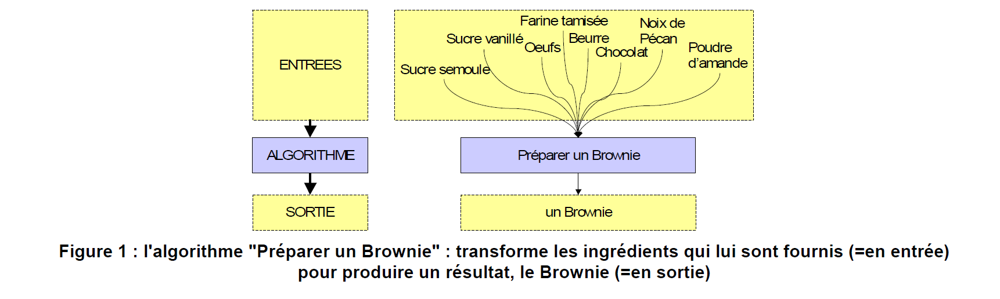
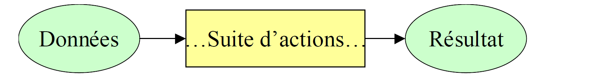
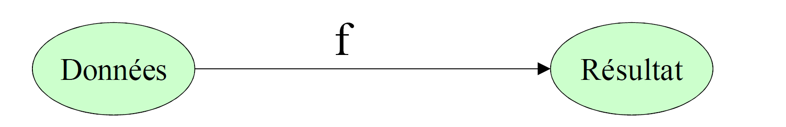
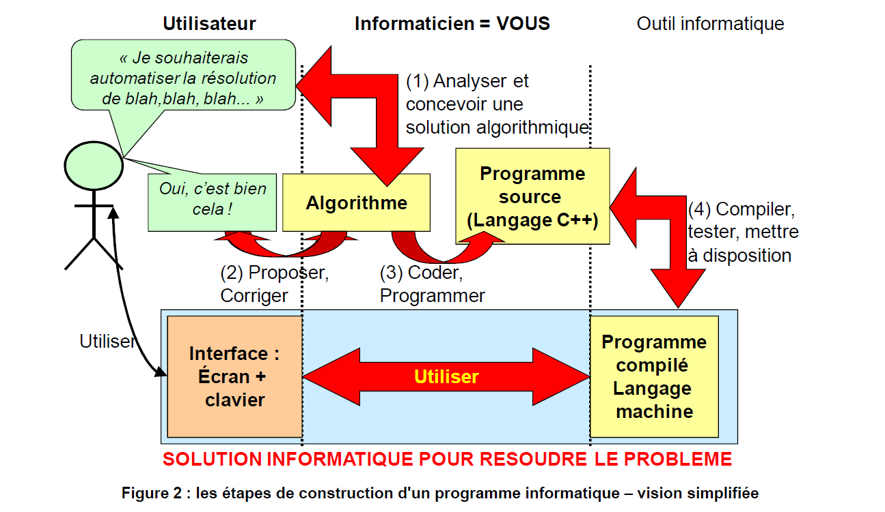
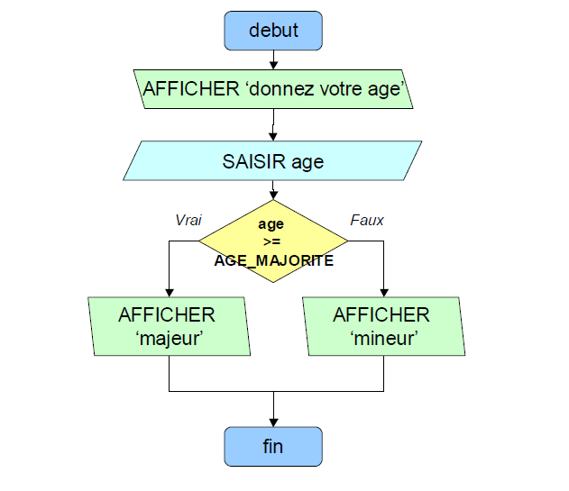
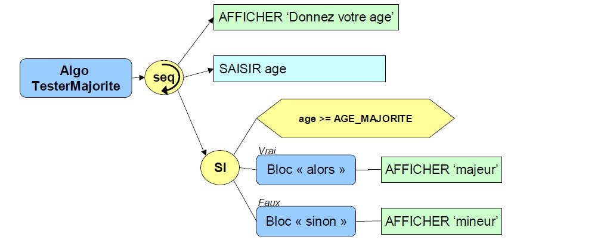
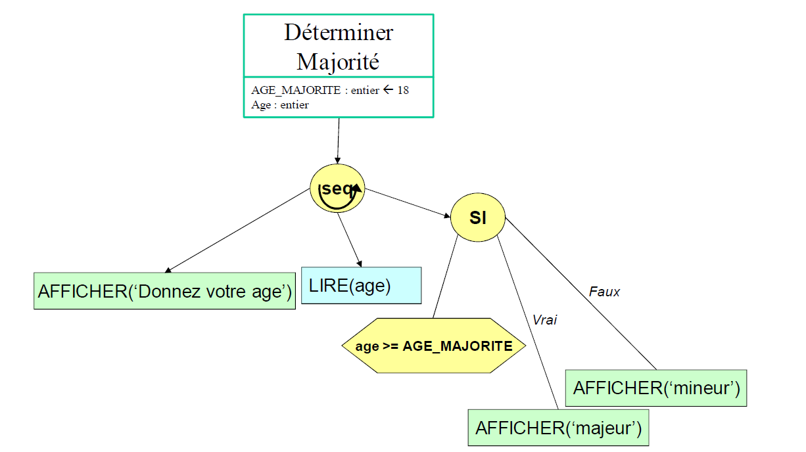

# <ins>**ALGORITHME**</ins>

___________________

## <ins>**INTRODUCTION**</ins>

<ins>**I) Définitions et exemples**</ins>

<ins>**A. à l'origine des algorithmes**</ins>

La notion d'algorithme remonte à l'antiquité (*3 milléntaires avant JC, chez les babyloniens, en Mésopotomaie, actuellement l'Irak*) et décrivait des méthodes de résolution d'équations. Le mathématicien grec **Euclide** (*plus récemment, 3 siècles av. JC*) a décrit la détermination du <ins>plus grand diviseur commun de 2 nombres sous forme d'une suite de calculs</ins>.

Mais c'est bien plus tard qu'on a pu nommer ces démarches "algorithme". C'est en effet du nom d'un mathématicien perse (800 ap. JC, actuel Ouzbékistan), **Al-Khawarizmi**, qu'on a introduit, 600 ans plus tard, vers 1550, le terme "Algorithme"

<ins>**B. L'algorithme**</ins>

> **Un ALGORITHME est un enchaînement ordonné d'actions élémentaires permettant l'obtention d'un résultat déterminé**.
> En d'autres termes :
> C'est **l'expression de la résolution d'un problème posé.**
> C'est **le moyen d'obtenir un résultat souhaité.**
> La **successions des actions** forme les étapes de la **résolution du problème** posé initialement **<- ->** on ne peut concevoir un algorithme que si un problème est soluble !

Synonymes ou termes proches ! **Procédure, Mode Opératoire, Programme, Recette**, etc..

> Chaque ACTION d'un algorithme modifie les éléments de détermination du résultat et représente une évolution nécessaire de la solution à laquelle on doit aboutir.

Certaines actions élémentaires, non décomposables.

D'autres actions regroupent un certain nombre d'actions élémentaires et constituent des procédures ou fonctions.


<ins>**C. L'Algorithmique**</ins>

> **L'ALGORITHMIQUE consiste en un ensemble de REGLES et de TECHNIQUES mis en oeuvre dans la construction des algorithmes.**.

<ins>**D. Le Processeur**</ins>

Les actions élémentaires d'un algorithme doivent être exécutées les unes à la suite des autres par un système de traitement ("un être humain" ou "une machine").

> Le **PROCESSEUR** est le système chargé d'exécuter l'algorithme : il devra savoir comment en exécuter chacune de ses actions élémentaires.
> Le Processeur des algorithmes est le plus souvent l'être humain.

Origine de processeur : anglais *to process* = traiter.

<ins>**E. Exemples d'Algorithmes**</ins>

Dans "la vraie vie", nous exécutons chaque jour des suites d'actions qui sont en fait des formes d'"algorithmes", le plus souvent inconsciemment.

<ins>**Exemple :**</ins> (résultat recherché : "La voiture est sortie du garage")

> <ins> Algorithme: "sortir la voiture du garage"</ins>
> 1. Aller jusqu'au garage
> 2. Ouvrir la porte du garage
> 3. Aller jusqu'à la voiture
> 4. ouvrir la portière
> 5. monter dans la voiture
> 6. Mettre la clef dans le contact
> 7. Démarrer le moteur
> 8. Passer la marche arrière
> 9. Reculer jusqu'à être à l'extérieur du garage
> 10. Arrêter le véhicule
> 11. Mettre au point mort
> 12. Arrêter le moteur
> 13. Retirer la clef du contact
> 14. Descendre de la voiture
> 15. Fermer la portière
> 16. Aller jusqu'au garage
> 17. Fermer la porte du garage
> 18. Aller jusq'à la voiture.
> 
> **->** Résultat = la voiture est dortie du garage (OK)

<ins>**Exemple :**</ins> (résultat recherché : un Brownie prêt à déguster)

> <ins> Algorithme : "Préparer un Brownie"</ins>
> 1. Mélanger le sucre semoule, le sucre vanillé, les oeufs et la farine tamisée.
> 2. Faire fondre le beurre.
> 3. Mettre le four à préchauffer.
> 4. Mélanger le beurre à la pâte jusqu'à avoir un mélange homogène.
> 5. Faire fondre le chocolat
> 6. Mélanger le chocolat à la pâte tant que le mélange n'est pas homogène
> 7. mélanger les npoix de Pécan et la poudre d'amande à la pâte
> 8. Verser la pâte dans un moule à gâteau beurré
> 9. Mettre à cuire pendant  35 minutes dans le four préchauffé à 170 °C
> 10. Arrêter le four
> 11. Sortir le gâteau
> 
> **->** Résultat =  Le Brownie est prêt (OK)

L'exécution des actions permettant la réalisation de la recette est **séquentielle** : les actions sont réalisées les unes à la suite des autres.

Certaines actions sont également répétées jusqu'à ce qu'elles soient complètement réalisées.

D'autres encore sont amenées à se déroulter en parallèle.

<ins>**F. Environnement d'un algorithme**</ins>

La suite d'actions constituant un algorithme nécessite très souvent l'utilisation d'éléments extérieurs, indispensables à l'exécution des actions élémentaires :

* les ingrédients dans le cas d'une recette.
* Le détail des salaires et dépenses pour la vérification d'un relevé de compte.

Un algorithme nécessite très souvent la <ins>fourniture d'éléments</ins> ("**en entrée**") pour produire un résultat ("**en sortie**").



<ins>**G. Caractèristique essentielle d'un algorithme**</ins>

> Un **ALGORITHME** devra fournir un **RESULTAT IDENTIQUE POUR LES MÊMES ELEMENTS FOURNIS EN ENTREE**, dans des conditions de fonctionnement identiques, ceci **EN UN TEMPS DETERMINE**.

<ins>**II) ALGORITHME ET MATHEMATIQUE**</ins>
___________________________

<ins>**A. Algorithmes Informatiques**</ins>

> Un **ALGORITHME INFORMATIQUE** est un enchaînement d'instructions élémentaires nécessaire à la résolution de problèmes généralement calculatoires (= en mettant en oeuvre des calculs).

Les éléments qui lui seront fournis en entrée et le résultat produit seront maintenant des <ins>données</ins> (représentations codées du monde réel) plutôt que des <ins>objets</ins> du monde réel.

On peut bien sûr étendre la "notion d'algorithme calculatoire" à toutes les formes de pilotage de machines et robots qui nécessitent des calculs complexes et appliqués à des données fournies par des capteurs sous forme de signaux numériques.

<ins>**B. Exemples**</ins>

Exemples d'algorithmes calculatoires **"de la vraie vie"** :

> <ins>Algorithme : "Calculer le coût d'un crédit"</ins>
> <ins>Données variables :</ins> Montant emprunté, remboursement mensuel, nombre de mois
> 1. Calculer le montant total remboursé = remboursement mensuel X nombre de mois
> 2. Calculer le coût du crédit = montant total remboursé - Montant emprunté.
>
> **->** Résultat = Coût du crédit.

> <ins> Algorithme : "Calculer la surface de papoer peint à poser dans une pièce rectangulaire.."</ins>
> <ins> Données en entrée : </ins> Hauteur de la pièce, Largeur de la pièce, Nombre de portes, Nombre de fenêtres.
> <ins> Données intermédiaires :</ins>
> <ins> Données constantes : </ins> Surface d'une porte : 2 m², Surface d'une fenêtre : 2 m².
>
> 1. Calculer la surface totale des murs = ((largeur + longueur) X 2) X hauteur
> 2. Calculer la surface des portes =  Surface d'une porte X Nombre de portes
> 3. Calculer la surface des fenêtres = Surface d'une fenêtre X Nombre de fenêtres
> 4. Calculer la surface de papier peint  =  Surface des murs - Surface des Portes - Surfaces des fenêtres.
>
> **->** Résultat = surface de papier peint

**Et pour reprendre l'algorithme élaboré par Euclide :**

> <ins>Algorithme : "Calculer le Plus Grand Commun Diviseur de  2 nombres."</ins>
> <ins> Données en entrée: </ins> Nombre1 et Nombre2, non nuls et Nombre1 > Nombre2.
> <ins> Données intermédiaires :</ins> Reste
> 1. Calculer le Reste de la division de Nombre1 par Nombre2
> 2. Tant que le Reste est différent de 0
> 3. Nombre1 prend la valeur de Nombre2
> 4. Nombre2 prend la valeur de Reste
> 5. Calculer le Reste de la Division de Nombre1 par Nombre2
>
> **->** Résultat = Valeur de Reste.



Dans le traitement des informations, on peut représnenter l'algorithme comme une fonction f, de D (les données) dans R (les résultats possibles) :



<ins>**C. De l'Algorithme Informatique au programme Informatique**</ins>

Pour qu'un Algorithme (Processeur = Être humain) puisse être exécuté par un ordinateur, il est nécessaire d'en effectuer la traduction dans un langage compréhensible par celui-ci (*Langage machine*)

> Un **PROGRAMME INFORMATIQUE** est une succession d'instructions écrites en langage machine et exécutables par un ordinateur, afin de traiter les données d'un problème et de renvoyer un résultat à l'utilisateur du programme.

Le terme **"Logiciel"** est souvent associé à une ensemble de programmes permettant de résoudre une <ins>catégorie de tâches</ins>.

Le **langage machine** (*dit "langage de bas niveau"*) étant complexe et délicat à écrire, les chercheurs ont inventé des langages plus simples à manipuler pour l'être humain, à mi-chemin entre la forme algorithmique (proche de la langue naturelle) et le langage machine : ce sont **les langages de programmation** (*dits "languages de haut niveau"*).

> L'activité de **CODAGE** ou **PROGRAMMATION INFORMATIQUE** consiste à traduire un algorithme en "programme source" exprimé dans un langage "cible" (celui vers lequel on traduit), généralement langage de haut niveau comme C, C++, PHP, Java, Logo, Visual Basic, etc.. (plus d'une centaine de langages informatiques).

La construction de l'algorithme est donc une des **premières tâches en programmation** et sera indispensable pour produire des **programmes de qualité**.



<ins>**D. Des Besoins des utilisateurs à l'Algorithme**</ins>

La constructions d'un algorithme n'est pas la première étape du processus de développement d'applications.

1. En effet, il est d'abord indispensable de bien comprendre les besoins réels de l'utilisateur afin d'établir un **cahier des charges** (expression exhaustive des besoins de l'utilisateur, définis dans un langage naturel)
2. Ce cahier des charges va ensuite être transformé en une **spécification des besoins**, document précisant dans un langage d'informaticien "ce qu'il faudra développer" pour répondre aux besoins exprimés dans le cahier des charges.
3. La phrase suivante sera la conception de l'algorithme permettant de définir le "comment développer ce qui esrt demandé", en utilisant 2 axes d'analyse :
   
   a. Analyse descendante : décomposition d'un problème de complexité inférieure; si les sous-problèmes paraissent encore trop complexes, ils sont décomposés à leur tour, etc.

   b. Analyse ascendate : composition d'une solution à partir de sous-algorithmes déjà  définis (et fiables).

La vision simplifiée, exprimée par la Figure 2, a pour objectif de montrer la nécessité de "définir, valider, écrire" avec pour aboutissement la production d'un algorithme, **<ins>avant</ins>** de "coder", de se lancer dans l'écriture du programme source dans un langage de programmation.

<ins>**E. Démarche pour l'écriture d'un Algorithme**</ins>

L'écriture d'un algorithme est l'aboutissement d'une phase d'analyse dont la méthode dépend souvent du problème posé. On peut donner **2 grandes étapes** :

1. **Analyse des Données** 
   **Recenser toutes les données au sens concept** ; chaque concept doit être représenté par un **objet** qu'il faut judicieusement nommer pour l'identifier; il faut ensuite distinguer les **objets constants et variables** ; puis il faut **classer les objets** pour distinguer ceux qui vont stocker les valeurs de base, intermédiaire et résultat.

   Pour recenser de manière exhaustive les objets, une méthode simple consiste à partir du résultat et à remonter aux données de base poar l'intermédiaire des formules de calcul.

2. **Structurer l'Algorighme**

Chercher la structure générale de l'algorithme : en général, on y trouve (parfois regroupées)

* Une phase d'**initialisation** de variables, par affectation de valeurs ou par lecture de l'environnement (par exemple, une saisie d'un utilisateur)
* Une phase de **traitement** dans laquelle les données sont transformées pour aboutir au résultat final.
* Une phase de fourniture du **résultat** attendu, par retour d'une valeur ou par écriture vers l'environnement (par exemple, un affichage sur un écran); cette phase est parfois intégrée à la phase précédente, des résultats intermédiaires apparaissant au fur et à mesure du traitement.

3. Module de contrôle et modules fonctionnels

Un algorithme complexe comportera très souvent :
* Un ensemble de modules fonctionnels (**des fonctions**) définissant les fonctions élémentaires assurés.
* Un module de contrôle de la séquence d'exécution des modules fonctionnels (**la fonction principale**)

<ins>**III) NOTATIONS ALGORITHMIQUES**</ins>
______________________

<ins>**A. Notations Algorithmiques.**</ins>

> Une **NOTATION ALGORITHMIQUE** est une représentation simplifiée (= un langage) permettant de définir <ins> sans ambiguïté</ins> un algorithme informatique de manière à ce qu'il soit lisible par tous.
>
> C'est une convention qu'on établit afin de pouvoir dialoguer avec le demandeur du programme. Il existe plusieurs notations algorithmiques.

**"Sans ambiguïté"** = sans qu'il y ai un doute, une seule interprétation possible.

**Notation :** Manière d'écrire, de représenter

**Convention =** Règles sur lesquelles on se met d'accord (c'est une forme de contrat).

> Les **PRIMITIVES** d'un langage algorithmique sont les instructions de base à partir desquelles on pourra construire toutes sortes d'algorithmes.

<ins>**B. Le Pseudo-Code.**</ins>

> Le **LANGAGE ALGORITHMIQUE**, ou **PSEUDO-CODE**, est la notation algorithmique la plus utilisée. Il définit un langage à mi-chemin entre le langage naturel et les langages de programmation, sans cependant tomber dans les aprticularités d'un langage de programmation spécifique.

<ins> Exemple d'algorithme exprimé en pseudo-code :</ins>

```
% à partir de la saisie de votre âge, cet algorithme détermine si vous êtes majeur %

ALGO TesterMajorite
ROLE Déterminer majeur ou pas en fonction de,l'âge
DECLARATION
CONSTANTES
    AGE_MAJORITE = 18
VARIABLES
    Vage : ENTIER

% actions à réaliser sur les données : CORPS %
DEBUT
    AFFICHER ("donnez votre âge")
    SAISIR (Vage)
    SI (Vage >= AGE_MAJORITE)
        ALORS
            AFFICHER ("majeur")
        SINON
            AFFICHER ("mineur")
    FinSI
FIN
```

<ins>**Attention :**</ins>
**Les langages algorithmiques ne sont pas standardisés : vous trouverez donc des variantes dans l'écriture des algorithmes, mais celles-ci ne devraient pas être un obstacle à la compréhension.**

<ins>**C. L'Organigramme (ou Ordinogramme).**</ins>

L'organigramme est une représentation graphique utilisant des symboles visuels pour représenter la suite d'actions élémentaires d'un algorithme.

<ins> Exemple d'algorithme sous forme d'organigramme :</ins>



<ins>**D. L'arbre programmatique.**</ins>

L'arbre programmatique est une évolution de l'organigramme et se rapproche du Pseudo-Code.

<ins>Exemple d'algorithme sous forme d'arbre progrmmatique (1)</ins>



<ins>Exemple d'algorithme sous forme d'arbre programamtique (2)</ins>



D'autres représentations comme le Grafcet, sont utilisés pour représenter les étapes de traitement des automates.

<ins>**IV) CONCLUSION**</ins>

<span class="bg-warning text-danger">**POURQUOI UTILISER ENCORE UN NOUVEAU LANGAGE ???**</span>

L'utilisation d'un langage algorithmique (ou autre notation graphique) pour exprimer les algorithmes part de plusieurs nécessités.

* **Réfléchir** à la conception d'une solution dans une langue proche de notre langue naturelle ou sous une forme visuelle accessible à tous.
* Pouvoir ainsi **Dialoguer** avec l'utilisateur demandeur.
* **Préparer** l'activité de codage informatique (programmation dans un langage informatique),
* **Libérer** des particularités des langages informatiques (on peut très bien avoir à demander le codage d'un algorithme à plusieurs programmeurs dans les langages informatiques différents)

> L'expression graphique d'un algorithme est intéressante si sa taille est relativement petite.
> 
> Dès lors que la taille de l'algorithme augmente, l'espace nécessaire ç la représentation des symlboles graphiques devient trop importante et la lisibilité s'en trouve diminuée.
>
> C'est pourquoi la notation en **PSEUDO CODE** est généralement privilégiée aujourd'ui pour représenter les algorithmes informatiques.

