## <ins>**BASES D'UN LANGAGE ALGORITHMIQUE**</ins>

<ins>**I) Introduction**</ins>
____________________________
<ins>**A. Structure générale d'un algorithme de fonction**</ins>

Dans le cadre d'une fonction prise isolément :
* L'identification de la fonction (son identificateur, les paramètres formels (attendus) et le type de donnée retourné) :

```
FONCTION estMajeur (age : ENTIER) : LOGIQUE
```

* L'indication du rôle de l'algorithme :

```
ROLE détermine la notion de majorité
```

* L'identification des données qui seront utilisées :

```
DECLARATIONS
CONSTANTES
    Age_MAJORITE = 18

VARIABLES
    résultat : LOGIQUE <- FAUX
```

* La suite d'actions à exécuter pour obtenir le résultat :

```
DEBUT
    SI (age >= AGE_MAJORITE) ALORS
        resultat <- VRAI
    FinSI
    RETOURNER resultat
FIN
```

<ins>**B. Structure générale d'un algorithme Principal**</ins>

Un algorithme exprimé en Pseudo-Code comporte les éléments suivants :
* l'identification de l'algorithme (son nom) :

```
ALGO TesterMajorite
```

* l'indication du rôle de l'algorithme :

```
ROLE Affichier "mineur" ou "majeur" en fonction de l'âge
```

* l'identification des éléments qui seront utilisés :

```
DECLARATIONS
    FONCTION estMajeur (age : ENTIER) : LOGIQUE
    VARIABLES
        unAge : ENTIER
```

* La suite d'actions à executer pour obtenir le résultat :

```
DEBUT
    AFFICHER "Donner votre âge"
    SAISIR unAge
    SI estMajeur(unAge) Alors
        AFFICHER "majeur"
    SINON
        AFFICHER "mineur"
    FinSi
FIN
```

<ins>**C. Les Commentaires : % ... %**</ins>

les Commentaires sont des explications textuelles ajoutées à l'algorithme afin d'apporter des informations supplémentaires au sujet de données ou de traitements effectués.

<ins>Syntaxe retenue</ins>

```
% .   .    .    n'importe quel texte .  .   .   . %
```
<ins>**D. Identifier et décrire l'algorithme**</ins>

Afin de préparer la phase de programmation, il est utile de donner un nom à l'algorithme afin de l'identifier de manière unique. La précision de son rôle est purement descriptif mais apporte une information sommaire sur son objectif.

<ins>Syntaxe retenue</ins>

```
ALGO nom de l'algorithme
ROLE commentaire explicatif
```

<ins>**E. Déclarer des données : DECLARATION**</ins>

Toutes les données nécessaires à un algorithme doivent être connues : il est indispensable de les recenser et de  :
* Les identifidr par un nom unique,
* ET, pour chacune, de décrire la nature des valeurs qu'elle peut prendre (son domaine de valeurs, ou type de données)

> La **DECLARATION** déclare l'existence des données qui seront utilisées dans l'algorithme (variable, constante) en leur attribuant un **<ins> identificateur</ins>** (nom de la donnée ou identifiant de la donnée), ainsi que le <ins>**type de cette donnée**</ins> (nature ou domaine de définition).

Lorsque l'algorithme sera devenu programme, la déclaration d'une variable va réserver un emplacement mémoire pour y stocker une valeur; cet amplacement sera accessible grâce à l'identifiant de la donnée.

> Un **TYPE DE DONNEE** détermine les valeurs autorisées pour le contenu d'une variable (nombres, chaîne, etc.) et donc les opérations réalisables sur cette variable.

On parle aussi de **domaine de définition** : l'ensemble des valeurs que peut prendre une donnée, et être défini
* en extension : liste de toutes les valeurs possibles
* ou en compréhension : avec une définition de l'ensemble (ex : les nombres entiers)

Les types de données généralement utilisés sont les suivants :
* **Caractères seuls** : les lettres de l'alphabet, les chiffres, etc..
* **Textes (chaînes de caractères)** : Assemblage de caractères qui forment un mot, une phrase
* **Nombres** :
  * **Entiers** : Nombres sans décimale
  * **Réels** : Nombres avec décimale
* **Valeurs logiques VRAI** et **FAUX**

<ins>**F. Décrire les instructions : DEBUT ... FIN**</ins>

Les mots-clefs **DEBUT** et **FIN** vont délimiter la partie de l'algorithme qui va décrire la séquence d'actions à réaliser.

Ces actions vont utiliser et modifier le contenu des données déclarées.

<ins>**II) Déclaration des données : Variables et Constantes**</ins>
___________________

Chaque donnée manipulé dans un algorithme doit comporter un **identificateur** (ou identifiant) associé aux élémentrs qui décrivent sa structure : nature (ou domaine de définitioin), valeur initiale.

<ins>**A. Types de données de base**</ins>

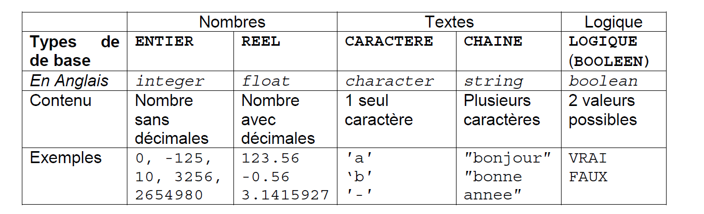

Concernant les nombres (simplifié ici en **ENTIER** et **REEL**) il est parfois nécessaire d'être plus précis. L'utilisation des ensembles peut être alors utilisée. Parfois même, il sera nécessaire de réduire ces ensembles à des plages de valeurs.

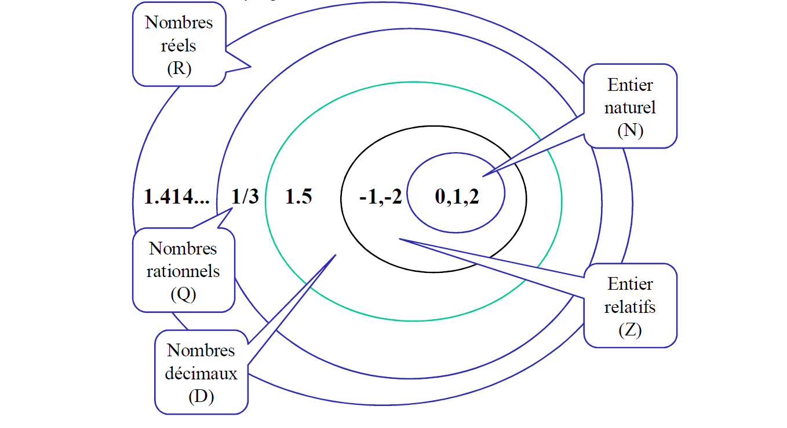

<ins>**B. Variables**</ins>

> Une **VARIABLE** est une donnée déclarée dont **LE CONTENU <ins>PEUT ÊTRE MODIFIE</ins>** au cours de l'exécution d'un algorithme (= son type de donnée est fixe, son contenu variable)

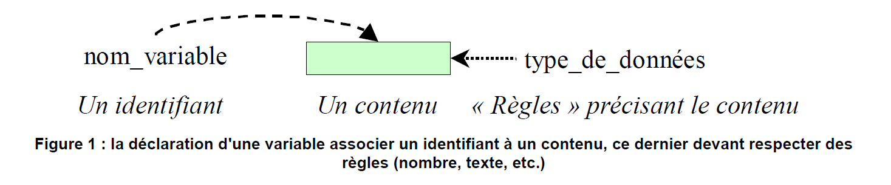

<ins>Syntaxe retenue</ins>

```
VARIABLE 
nom_variable : type_de_données [<- valeur_initiale]
```
* **nom_variable**
  * identificateur unique de la variable
  * composé de lettres et de chiffres et du caractère "_" (convention retenue)
* **type_de__données** est l'un des types défini ci-dessus
* **valeur_initiale** (Optionnel) est une valeur affectée à la variable avant le début de l'algorithme.

<ins>Exemples: </ins>

```
VARIABLES
    age : ENTIER
    prime : REEL
    lettre : CARACTERE
    titre : CHAINE
    estMajeur : BOOLEEN
```

<ins>**C. Constantes**</ins>

> Une **CONSTANTE** est une donnée dont **LE CONTENU <ins>NE PEUT PAS ÊTRE MODIFIE</ins>** au cours de l'exécution d'un algorithme.

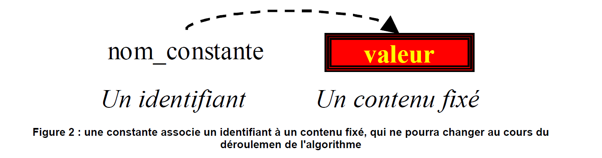

<ins>Syntaxe retenue</ins>

```
CONSTANTES NOM_CONSTANTE : type_de_données <- valeur
```

* **NOM_CONSTANTE**
  * identificateur unique de la constante, composé de lettres majuscules et de chiffres et du caractère "_" (convention retenue)
* **valeur**
  * valeur du contenu que prendra cete constante tout au long de l'algorithme.

<ins>Exemples: </ins>

```
CONSTANTES
    PI : REEL <- 3.1415927
    TAUX_EURO : REEL <- 6.55957
    MOT_ACCUEIL : CHAINE <- "Bonjour !"
    NOMBRE_DEBUT : ENTIER <- 1, NOMBRE_FIN : ENTIER <- 10
    DEBUT_ALPHABET : CARACTERE <- 'a'
```

<ins>**D. Au sujet des conventions de nommage**</ins>

> Une **CONVENTION DE NOMMAGE** détermine les règles (caractères utilisées et agencement de ces caractères) qu'on se fixe pour attribuer des noms aux variables, constantes, nom d'algorithmes, de programmes, etc...

**<ins>Important</ins>**

**Les conventions de nommage participent à la qualité des algorithmes et des programmes : il est important d'en définir ... et de les respecter !**

<ins>**III) Instruction d'affectation, opérateurs et expressions**</ins>
___________________

<ins>**A. Valeurs littérales, ou littéraux**</ins>

> Une **VALEUR LITTERALE**, ou un **LITTERAL**, désigne **UNE VALEUR D'UN CERTAIN DOMAINE DE VALEURS** (nombre, caractère, texte, etc...), **SANS IDENTIFICATEUR**.

On peut dire qu'un littéral est un contenu sans identifiant.

Exemple de littéraux : 2010, -100, 1, 3.14, 'z', "bonjour"

> Une signe - (moins) précède une valeur numérique (ENTIER ou REEL) pour indiquer qu'elle est négative.

<ins>**B. Expressions et opérateurs**</ins>

> Une **EXPRESSION** désigne le calcul d'une valeur à partir d'autres valeurs (littéraux, constantes et variables) et d'opérateurs. Les opérateurs utilisés dans une expression déterminent le domaine de valeur du résultat..
> **L'EVALUATION D'UNE EXPRESSION** consiste à effectuer le calcul contenu dans cet expression afin d'obtenur la valeur résultante.

<ins>**La valeur résultant de l'évaluation d'une expression est perdue, à moins d'être conservée comme contenu d'une variable : c'est l'objet de l'instruction d'affectation (voir plus bas)**</ins>

<ins>**1. Expressions numériques**</ins>

> Une **EXPRESSION NUMERIQUE** est une expression utilisant des valeurs de type ENTIER ou REEL et des opérateurs arithmétiques, et qui a pour valeur un nombre.

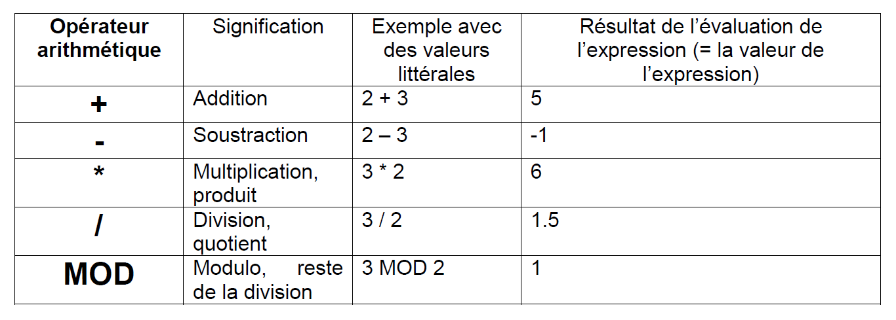

Dans une expression numérique comportant plusieurs opérateurs, les calculs intermédiaires sont effectués selon la priorité des opérateurs : (idem Mathématiques) : **EMDAS*** (Exponentiation, Multiplication et Division et Modulo, Addition et Soustraction), puis, au même niveau de priorité, de la gauche vers la droite.

* Par exemple : 2 + 3 * 5 **->** effectuer 3 * 5, soit 15, puis ajouter 2 **->** 17

**L'usafe des parenthèses est fortement conseillé** afin de définir le calcul sans ambiguïté (mais aussi d'améliorer la lisibilité des expressions) :

* Par exemple : (2 + 3) * 5 **->** effectuer (2 + 3), soit 5, puis  5 * 5 **->** 25.

<ins>**2. Expressions alphanumérique**</ins>

> Une **EXPRESSION ALPHANUMERIQUE** est une expression combinant des valeurs de type CARACTERE ou CHAÎNE et un opérateur alphanumérique.

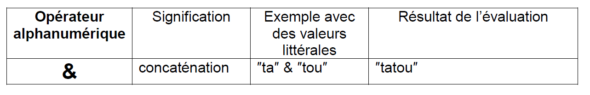

<ins>Exemple: </ins>

```
"ta" & "tou" & "12"    % va donner la valeur "tatou12" %
```

<ins>**3. Expressions logiques et opérateurs relationnels**</ins>

> Une **EXPRESSION LOGIQUE ou BOOLEENNE** est une expression dont le résultat est une valeur logique ou booléenne, soit VRAI ou FAUX.
>
> Elle peut résulter de la combinaison de valeurs (littéraux, variables, constantes, expressions arithmétiques, etc) et d'opérateurs relationnels.

Les opérateurs relationnels mettent en relation 2 valeurs pour les comparer :

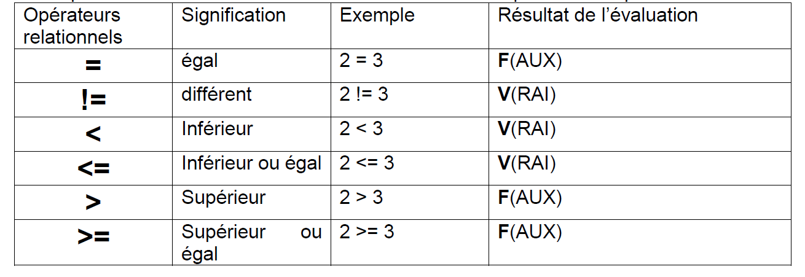

<ins>Exemple: </ins>

(age >= 18)  **->** VRAI si age est >= 18, FAUX sinon

(1 = 1) **->** toujours VRAI

(1 = 2) **->** toujours FAUX

( ( age + 2) < (3 * 6) ) **->** VRAI si age est inférieur à 16

<ins>**4. Expressions logiques et opérateurs logiques**</ins>

> Une **EXPRESSION LOGIQUE** peut aussi résulter de la combinaison de valeurs logiques et d'opérateurs logiques.

Les opérateurs logiques ET, OU, et NON permettent la construction d'expressions logiques plus élaborées :

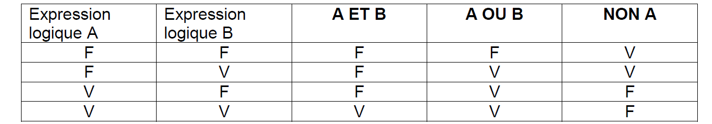

<ins>Exemple: </ins>

(age >= 18) ET (note > 10) **->** VRAI si les  2 expressions sont vraies - FAUX sinon

(age >=18) OU (note >10) **->** VRAI si au moins une des deux expressions logique est VRAI - FAUX sinon.

<ins>**C. L'affectation**</ins>

> L'**AFFECTATION** est l'opétation qui REMPLACE le contenu d'une variable avec une nouvelle valeur.

La nouvelle valeur doit être de même nature que la variable affectée.

L'affectation modifie l'état des variables de l'algorithme et le fait progresser vers le résultat.

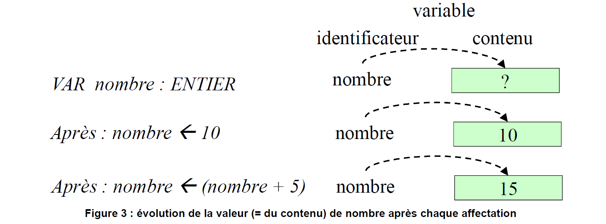

<ins>Syntaxe retenue</ins>

```
nom_variable <- littéral_ou_expression
```

* Nom_variable
  * nom d'une variable préalablement déclarée
* littéral_ou_expression
  * valeur à affecter à la variable, valeur littérale, résultat de l'évaluation d'une expression, etc.

<ins>Exemples avec des valeurs littérales </ins>

age <- 20
prime <- 120.5
estMajeur <- VRAI
titre <- 'titre du programme'
lettre <- 'a'

<ins>Exemples avec des expressions </ins>
age <-  (20 + 5)
prime <- (120.5 * (1 + 0.50))
estMajeur <- (age > 17)
titre <-  "titre" & "du" & "programme"

<ins>**D. Conseil au sujet des variables**</ins>

> **L'INITIALISATION D'UNE VARIABLE** consiste à lui affecter une valeur initiale en fonction de son domaine de valeurs et avant le début de l'algorithme **<- ->** TOUTE VARIABLE DOIT SUBIR UNE AFFECTATION AVANT D'ÊTRE UTILISEE.

En général, à une variable 
* Caractère, on affecte la valeur '' (un caractère vide),
* Chaîne, on affecte la  valeur "" (un texte vide),
* Numérique, on affecte la valeur 0,
* Logique, on affecte la valeur FAUX.

<ins>**IV) Instruction d'Entrée-Sortie**</ins>
___________________

Les actions d'entrée-sortie vont permettre de définir des possibilités simples d'intéractions entre l'algorithme et son utilisateur.

Des messages pourront lui être envoyés, et il pourra intervenir dans le déroulement de l'algorithme en fournissant des données nécessaires à son fonctionnement.

<ins>**A. Afficher  des Informations : ECRIRE**</ins>

> L'action **ECRIRE** consiste à envoyer une information (un texte, une valeur calculée, etc.) à un utilisateur.

Autre  Syntaxe possible : AFFICHER, SORTIR

<ins>Syntaxe retenue</ins>

```
ECRIRE (exp1, exp2, ... , expN)
```

* exp1, exp2, expN représentent
  * l'expression ou les expressions dont on commande l'envoi
  * un code particulier permettant de sauter une ligne : NL (Pour Nouvelle Ligne)

<ins>Exemplew</ins>

ECRIRE 'bonjour'
ECRIRE 'bonjour' , nomEtudiant

<ins>**B. Récupérer des données : LIRE**</ins>

> L'action **LIRE** consiste à récupérer une information fournie par l'utilisateur afin de l'affecter à une variable.

Autre Syntaxe :  SAISIR, ENTRER

<ins>Syntaxe retenue</ins>

```
Lire (nom_variable1, nom_variable2, ...)
```

* nom_variable1, nom_variable2 
  * Nom d'une ou plusieurs variables qui vont recevoir les données fournies par l'utilisateur.


<ins>Exemple</ins>

LIRE age
LIRE nomEtudiant

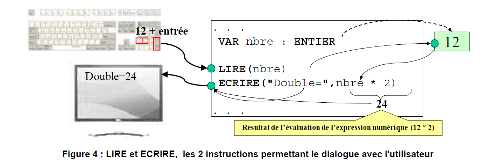

<ins>**V) Premier test d'un algorithme**</ins>

<ins>**A. Algorithme**</ins>

La numérotation des instructions va permettre le suivi du déroulement de l'algorithme :

```
% But de l'algo : Calculer et afficher un montant TTC à partir de la saisie d'un nombre de produits et du prix HT du produit %

% Nom : Moi %

% Date de création : 20/12/2022 %

ALGO CalculetteTTC
ROLE Calculer un montant TTC à partir d'un nombre de produits
DECLARATIONS
CONSTANTES
    TAUX_TVA = 19.6
VARIABLES
    nombre : ENTIER
    prixUnitHT, montantHT, montantTVA, montantTTC : REEL

DEBUT
1.       ECRIRE "Donnez le nombre de produits"
2.       LIRE nombre
3.       ECRIRE "Donnez le prix unitaire"
4.       LIRE prixUnitHT
5.       montantHT <- nombre * prixUnitHT
6.       montantTVA <- montantHT * 19.6 / 100
7.       montantTTC <- montantHT + montantTVA
8.       ECRIRE "TTC : ", montantTTC
FIN
```

<ins>**B. Trace d'exécution**</ins>

> La **TRACE D'EXECUTION** permet de **suivre le déroulement d'un algorithme** pas à pas (action après action) afin de s'assurer de son bon fonctionnement.
>
> L'exécution est manuelle (VOUS êtes le processeur)

Exemple :

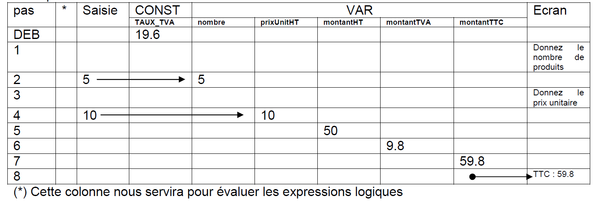

Les traces d'exacution permettent d'effectuer une première vérification de la validité de l'algorithme.

Cependant, on peut déjà noter la difficulté à assurer une validité complète d'un algorithme. Celle-ci qui nécessite en effet la vérification de nombreux cas de tests, pour différentes valeurs saisies, les unes correctes, les autres non...
Le programme isso de l'algorithme devra aussi faire l'objet de tests sévères pour s'assurer de son bon fonctionnement.
