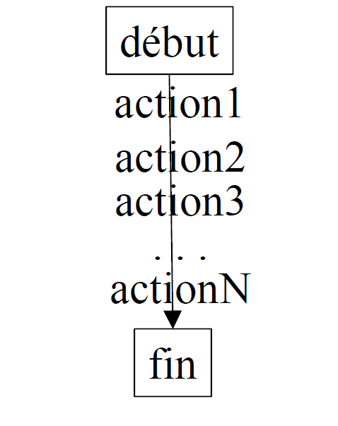
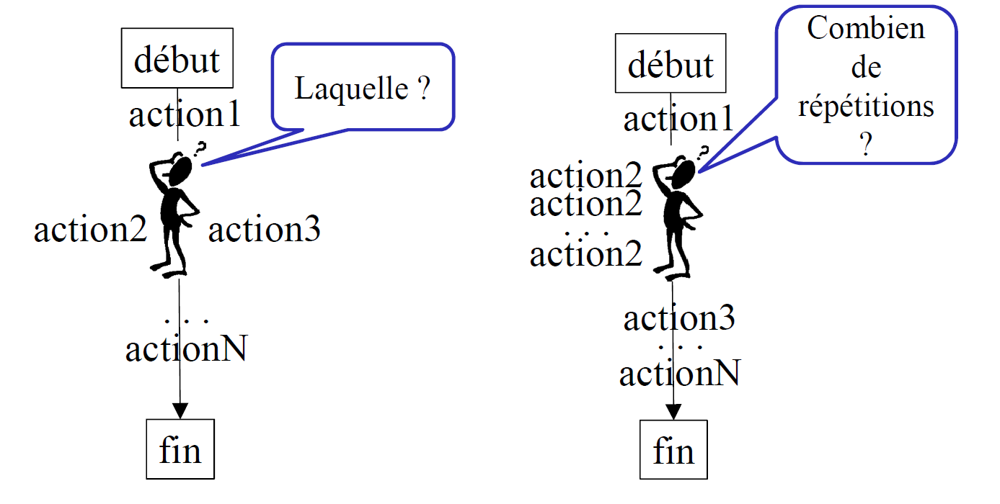
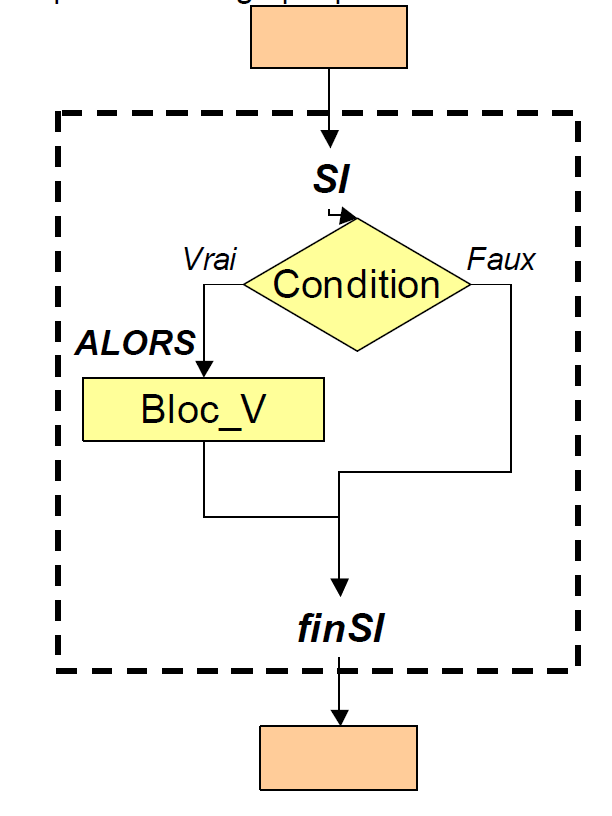
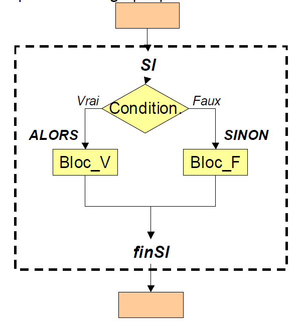
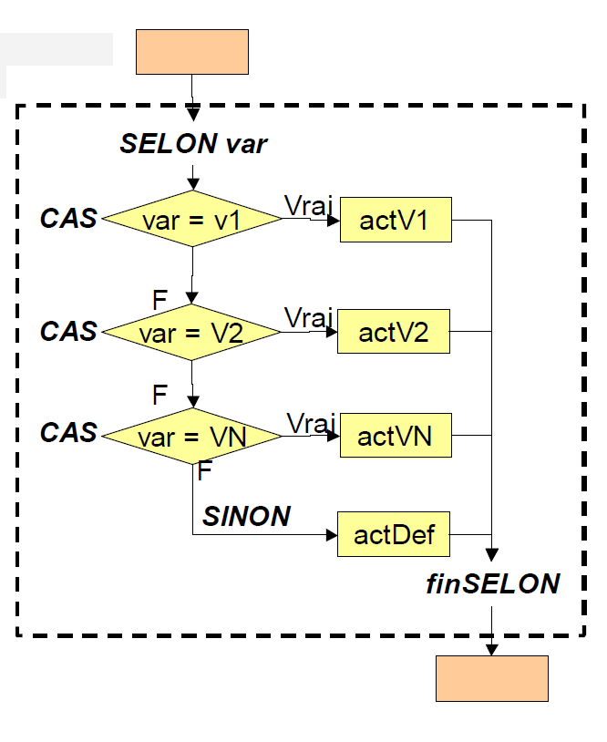
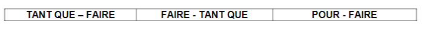
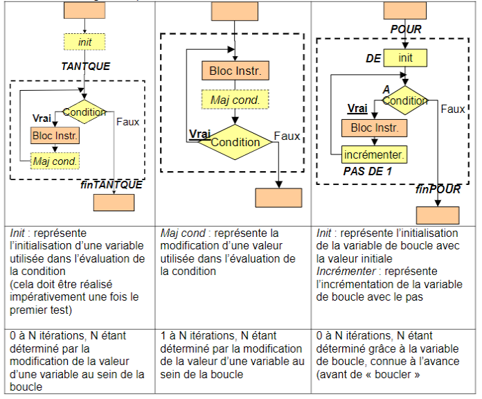
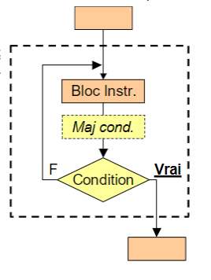

## <ins>**LES STRUCTURES DE CONTRÔLE**</ins>

<ins>**I) Introduction**</ins>
____________________________
<ins>**A. Déroulement linéaire d'un Algorithme : une séquence d'actions**</ins>

Nous avons étudié jusqu'à présent des algorithmes constitués par une succession non interrompue d'actions :

* Affectations, calculs
* Lectures et écritures d'informations.

Ces actions forment un bloc dont le déroulement est linéaire, ininterrompu.



Il arrive cependant que certains problèmes exigent l'interruption du déroulement séquentiel pour une prise de décision, ou bien pour une exécution répétée de certaines actions.



<ins>**B. Rupture de l'exécution linéaire : choix et répétitions**</ins>

> Les **STRUCTURES DE CONTRÔLES** permettent la modification du déroulement d'un algorithme; elles constituent une rupture dans l'exécution en séquence des actions en proposant
> * un choix dans l'exécution de blocs d'actions : **STRUCTURES DE CONTRÔLES CONDITIONNELLES**,
> * ou une répatition dans l'exécution d'un bloc d'actions : **STRUCTURES DE CONTRÔLES REPETITIVES.**
>
> Ces **STRUCTURES SONT BASEES SUR L'EVALUATION D'EXPRESSIONS LOGIQUES**, plus simplement appelées **CONDITIONS**, ou **TESTS**.

<ins>**II) Choisir : Structures de contrôles conditionnelles**</ins>
____________________________

<ins>**A. Structure conditionnelle simple**</ins>

> La **STRUCTURE CONDITIONNELLE SIMPLE** permet l'exécution d'un bloc d'instructions seulement **SI UNE CONDITION EST VRAIE** ( = l'évaluation d'une expression logique a pour valeur VRAI), sinon aucune isntruction n'est exécutée.

<ins>Syntaxe retenue</ins>

```
SI (expression_logique) ALORS
    ... bloc d'actions ...
FinSi
```

* **expression_logique**
  * représente l'expression logique à évaluer : c'est la condition qui va autoriser ou non l'exécution du bloc d'instruction qui suit le **ALORS**
* bloc d'actions
  * bloc d'instructions à exécuter si 'expression_logique" a pour valeur VRAI

Représentation graphique : 



Si la condition est **VRAIE** (=l’évaluation de ‘Expr.Log.’ est égal à **VRAI**), alors le bloc d’actions Bloc_V est exécuté, puis on poursuit l’exécution après la fin de la structure de contrôle (marquée par finSI)

Si la condition **N'EST PAS VRAIE**, on poursuit l'exécution après la fin de la structure de contrôle (marquée par FinSI)

```
Si (age >= AGE_MAJORITE) ALORS
    AFFICHER "Vous êtes majeur !"
FinSI
```

**= "à condition que Vage soit plus grand ou égal à AGE_MAJORITE (18) alors j'affiche la chaîne de caractères : vous êtres majeur ! "**

<ins>**B. Structure conditionnelle alternative**</ins>

> La  **STRUCTURE CONDITIONNELE ALTERNATIVE** permet l'exécution d'un bloc d'actions si une expression logique a pour valeur VRAI et d'un autre bloc d'actions dans le cas contraire.
>
> Elle offre le choix entre 2 possibilités d'action.

<ins>**Syntaxe retenue**</ins>

```
SI (expression_logique) ALORS
    ... bloc d'actions 1 ...
SINON
    ... bloc d'actions 2 ...
FinSI
```

* **expression_logique**
  * représente l'expression logique à évaluer
* **bloc d'actions 1** :
  * représentent le bloc qui sera exécuté si 'expression_logique' a pour valeur VRAI
* **bloc d'actions2** :
  * représentent le bloc qui sera exécuté si 'expression_logique' n'a pas pour valeur VRAI (sinon)




Si la condition est **VRAIE**, **ALORS** le bloc <ins>Bloc_V</ins> est exécuté **SINON** (la condition **N'EST PAS VRAIIE**), le bloc d'instructions <ins>Bloc_F</ins> est exécuté

<ins>Exemple</ins>

```
SI (age >= AGE_MAJORITE) ALORS
    AFFICHER "Vous êtes majeur !"
SINON
    AFFICHER "Vous êtes mineur !"
FinSI
```

<ins>**C. Structure conditionnelle à choix multiples**</ins>

> La **STRUCTURE CONDITIONNELLE A CHOIX MULTIPLE** permet de choisir entre plus de 2 possibilités de blocs d'actions à exécuter en fonction de valeurs différentes d'une variable.

<ins>Syntaxe retenue</ins>

```
SELON (nom_variable)
    CAS valeur1 :
        ... bloc d'actions 1 ...
    CAS valeur2 :
        ... bloc d'actions 2 ...
    CAS valeurN :
        ... bloc d'actions N ...
    SINON
        ... bloc d'actions sinon ...
FinSelon
```

* **nom_variable**
  * représente une variable
* **valeur1, valeur2, valeurN** :
  * représente chacune des valeurs à tester (**égalité**)
* **bloc d'actions 1, 2, N, sinon** :
  * représentent les blocs à exécuter dans chacun des cas : UN SEUL BLOC SERA EXECUTE

Exemple :

```
SELON (mois)
    CAS 1 :
        AFFICHER "Janvier"
    CAS 2 :
        AFFICHER "Février"
    
    ... autres cas ...

    Cas 12 :
        AFFICHER "Décembre"
    SINON
        AFFICHER "Le numéro de mois est erroné"
FinSelon
```



<ins>**III) Répéter : Structures de contrôles répétitives, ou Boucles**</ins>
____________________________

<ins>**A. Généralités**</ins>

> Les **STRUCTURES REPETITIVES** permettent l'exécution répétée d'un bloc d'instructions. Le nombre de répétitions est contrôlé par une **CONDITION DE POURSUITE OU D'ARRÊT DE LA REPETITION**.

Synonymes : boucles, itérations (structures itératives)

La condition d'arrêt peut être exprimée de 2 manières logiques :

* Logique de continuité : tant que "quoi" la boucle continue-t-elle ?
* Logique d'arrêt : Quand la boucle s'arrête-t-elle ?

**ATTENTION**
**LA CONDITION D'ARRET (ou de poursuite) D'UNE BOUCLE DOIT ÊTRE PARFAITEMENT IDENTIFIEE.**

<ins>**B. Boucle TANT QUE - FAIRE**</ins>

> La boucle **TANT QUE** permet d'exécuter un bloc d'instructions **SI une expression logique est VRAIE et TANT QU'elle est vraie**. Le bloc d'actions s'exécutera 0 à N fois.

<ins>**Syntaxe**</ins>

```
TANT QUE (expression_logique) FAIRE
    ... Bloc d'instructions à répéter
FinTantQue
```

* **Expression_logique** (=test, condition)
  * l'expression à évaluer : si **VRAI**, exécution du bloc d'instructions, et répatition de l'exécution **TANT QUE** cette expression logique a pour valeur **VRAI**
* **bloc d'instructions**
  * bloc d'instructions à exécuter

```
AFFICHER "Entrez un nombre supérieur à 10 : "
SAISIR Vnombre
TANT QUE Vnombre <= 10 FAIRE
    AFFICHER "Entrez un nombre supérieur à 10 :"
    SAISIR Vnombre
FinTantQue
```

C'est ici la condition <ins>(Vnomvre <= 10)</ins> qui va servir à déterminer la condition de poursuite de la boucle.

<ins>**ATTENTION**</ins>
<ins>**Les données permettant d'évaluer l'expression logique doivent avoir été initialisés auparavant ET devront être à nouveau initialisés dans le bloc d'instructions (sinon on obtient une boucle infinie !)**</ins>

<ins>**C. BoucleFAIRE - TANT QUE**</ins>

> La boucle **FAIRE  .... TANT QUE** permet d'exécuter un bloc d'instructions **AU MOINS UNE FOIS ET TANT QU'UNE CONDITION EST VRAIE.**
>
> Le bloc d'actions s'exécutera de 1 à N fois.

<ins>Syntaxe</ins>

```
FAIRE
    ... Bloc d'action(s) à répéter
TANT QUE (expression_logique)
```

* **Expression_logique**
  * l'expression à évaluer : exécution du bloc d'instructions 1 fois, et répétition éventuelle **TANT QUE** cette expression logique a pour valeur **VRAI**.
* **bloc d'instructions**
  * bloc d'instructions à exécuter

```
FAIRE
    AFFICHER "Entrez un noimbre supérieur à 10 :"
    SAISIR (Vnombre)
TANT QUE Vnombre <= 10
```

C'est ici la variable <ins>Vnombre <= 10)</ins>  qui va servir à déterminer la condition de poursuite de la boucle plus d'une fois.

<ins>**ATTENTION**</ins>

<ins>**Les données permettant d'évaluer l'expression logique doivent être initialisées dans le bloc d'instructions (sinon on obtient une boucle infinie !)**</ins>

<ins>**D. Boucle POUR - FAIRE**</ins>

> La boucle **POUR** permet de **REPETER** l'exécution d'un bloc d'instructions **UN NOMBRE DE FOIS DETERMINE**.
>
> Le décompte du nombre de fois est réalisé en faisant varier une **variablede boucle** : cette dernière permet de compter le nombre de boucles et sert à déterminer la conditiond 'arrêt.
> **LE NOMBRE D'ITERATIONS EST CONNU**.

<ins>Syntaxe : </ins>

```
Pour var_boucle DE val_deb A val_fin PAS DE val_pas FAIRE
    ... Bloc d'instructions à répéter  ...
FinPour
```

* **var_boucle**
  * Représente le nom de la variable numérique (ENTIER) qui va servir de compteur de boucle (variable de contrôle de boucle) (En anglais **loop counter**)
* **val_deb** : valeur initiale de 'var_boucle' (En anglais **initial value**)
* **val_fin** : valeur finale de 'var_boucle' : la boucle va s'arrêter quand 'var_boucle > val_fin' ou va continuer tant que 'var_boucle <= val_fin' (En anglais **loop-continuation condition**) ; cette valeur détermine si oui ou non une boucle doit continuer ou s'arrêter.
* **val_pas** : c'est le pas d'incrémentation (ou de décrémentation s'il est négatif) de 'var_boucle' à chaque itération (En anglais **increment / decrement**) ; cette caleur modifie la variable de contrôle de boucle à chaque passage = à chaqie itération de la boucle (En anglais **in each iteration of the loop**)

```
POUR i DE 1 A 10 PAS DE 1 FAIRE
    AFFICHER "Vous êtes à la boucle numéro :"
    AFFICHER i
FinPOUR
```

C'est ici la variable i qui va servir à déterminer la condition de poursuite de la boucle (la condition i <= 10) (=tant que i est inférieur ou égal à 10)

<ins>**E. Comparaison des boucles**</ins>





<ins>**F. Boucle FAIRE ... JUSQU'A**</ins>

**Dans les 2 formes de boucles précédentes (TANT QUE - FAIRE , FAIRE - TANT QUE), LA REPETITION EST <span class="bg-warning text-danger">POURSUIVIE</span> <ins> SI UNE EXPRESSION LOGIQUE EST VRAIE, ET TANT QU'ELLE EST VRAIE.</ins>**

**<ins>Dans la forme REPETER - JUSQU'A.</ins> LA REPETITION EST ARRETEE <ins>dès QU'UNE EXPRESSION LOGIQUE EST VRAIE.</ins>**

> La boucle **REPETER ... JUSQU'A** permet d'exécuter un bloc d'instructions AU MOINS UNE FOIS et **JUSQU'A** CE QU'UNE EXPRESSION LOGIQUE SOIT VRAIE.
>
> Le bloc d'actions s'exécutera 1 à N fois.

<ins>Syntaxe : </ins>

```
REPETER
    ... Bloc d'action(s) à répéter ...
JUSQU'A (expression_logique)
```

* **Expression_logique**
  * représente l'expression à évaluer : **<ins> Si cette expression a pour valeur VRAI, ARRET DE l'exécution du bloc d'instructions.</ins>**
* **bloc d'instructions**
  * bloc d'instructions à exécuter

```
FAIRE
    AFFICHER "Entrez un nombre supérieur à 10 :"
    SAISIR Vnombre
JUSQU'A Vnombre > 10
```

C'est ici la variable <ins>Vnombre</ins> (Vnombre > 10) qui va servir à déterminer l'arrêt de la répatition.

**<ins>ATTENTION</ins>**

**<ins>Les données permettant d'évaluer la condition doivent être modifiées dans la boucle (bloc Maj cond) sinon on obtient une boucle infinie !</ins>**



<ins>**G. Equivalences des structures répétitives (itératives)**</ins>

<ins>Problème: </ins>

On souhaite construire un algorithme qui affiche les nombres de 1 à Vnombre, Vnombre étant saisi par l'utilisateur.

```
SAISIR Vnombre
```

**POUR** (= <ins>Structure la plus adaptée dans ce cas</ins>)

```
POUR i DE 1 A Vnombre PAS DE 1 FAIRE
    AFFICHER i
FinPour
```

**TANT QUE - FAIRE**

```
i <- 1
TANT QUE i <= Vnombre FAIRE
    AFFICHER i
    i <- i + 1
FinTantQue
```

**FAIRE - TANT QUE**

```
i <- 1
FAIRE
    AFFICHER i
    i <- i + 1
TANT QUE i <= Vnombre
```

(i <= Vnombre) : j'exécute le bloc 1 fois, puis, tant que c'est vrai, je répète l'exécution.

**ATTENTION : Si l'utilisateur saisit la valeur '0', on passe une fois dans la boucle : pour palier à ce défaut, il faut ajouter une structure conditionnelle :**

```
Si Vnombre >= 1 ALORS
    i <- 1
    FAIRE
        AFFICHER i
        i <- i + 1
    TANT QUE i <= Vnombre
FinSi
```

**FAIRE - JUSQU'A / REPETER - JUSQU'A**

```
i <- 1
FAIRE
    AFFICHER i
    i <- i + 1
JUSQU'A i > Vnombre
```

i > Vnombre : j'exécute le bloc 1 fois, puis tant que c'est vrai, je répète.
Si l'utilisateur saisit la valeur '0', on passe une fois dans la boucle ; (idem ci-dessus)

<span style="color: #26B260">**Pour passer d'une boucle TANT QUE à une boucle JUSQU'A, il faut inverser le test.**</span>

<ins>**IV) Structures imbriquées**</ins>
____________________________

Les blocs exécutés au sein des structures de contrôle peuvent comporter eux-mêmes des structures de contrôle imbriquées (et ainsi de suite).

Attention cependant au nombre de niveau d'imbrications, préjudiciable à l'intelligibilité des algorithmes.

<ins>**A. Structure conditionnelles imbriquées**</ins>

<ins>Exemple syntaxe 1 :</ins>

```
SI expression_logique 1 ALORS
    SI expression_logique 2 ALORS
      ... bloc d'instructions (1 ET 2)
    SINON
      ... bloc d'instructions (1 ET NON 2)
    FinSi
SINON
    SI expression_logique 3 ALORS
      ... bloc d'instructions (NON 1 ET 3)
    SINON
      bloc d'instructions (NON 1 ET NON 3)
    FinSi
FinSi
```

<ins>Exemple syntaxe 2 :</ins>

```
SI expression_logique 1 ALORS
    ... bloc d'instructions 1
  SINON SI expression_logique 2 ALORS
    ... bloc d'instructions 2
  SINON SI expression_logique 3 ALORS
    ... bloc d'instructions 3
  SINON
    ... bloc d'instructions N
FinSI
```


