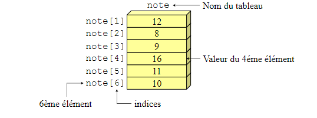
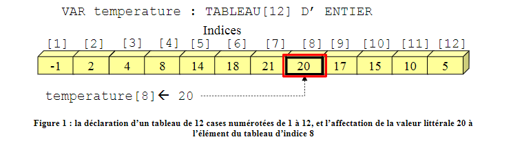
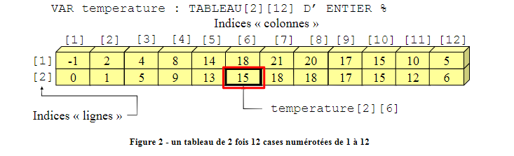

## <ins>**TYPES DE DONNEES COMPOSES : TABLEAUX ET STRUCTURES**</ins>

<ins>**I) Introduction**</ins>
____________________________

<ins>**A. Rappels au sujet des types de données**</ins>

les données disponibles pour réaliser un algorithme sont, de base, élémentaires :

* nombres : entiers et réels
* caractères et chaînes de caractères
* valeurs logiques.

Il arrive cependant très souvent que nous ayons à traiter, dans les algorithmes,

* d'un grand nombre de données de même nature :
  * effectuer une recherche sur un ensemble de nombres, trier,etc.
* ou bien sur des données ayant une forme plus complexe :
  * en dessin 2D, la notion de "point" correspond à la définition de  2 ou 3 nombres entiers : l'abscisse (X), l'ordonnée (Y), un code couleur.

<ins>**B. Notion de TABLEAU**</ins>

<ins>Un exemple de problème à traiter : </ins>

Demander la saisie de  20 nombres entiers, trier ces nombres dans l'ordre croissant et afficher les nombres dans le bon ordre.

Une première réflexion autour de la transcription en pseudo-code de la résolution du problème noous permet d'écrire :

```
%  Déclaration de  20 nombres entiers   %
VAR Vn1, Vn2, Vn3, ...., Vn18, Vn19, Vn20 : ENTIER

% Demander la saisie des 20 nombres  %
ECRIRE "Saisir le nombre 1"
LIRE Vn1
ECRIRE "SAisir le nombre 2"
LIRE Vn2
ECRIRE "Saisir le nombre 3"
LIRE Vn3
... etc ... (En tout 40 lignes de code ...)

%  Il faudra ensuite trier les nombres. Bon courage ... %
```

Afin de traiter un ensemble de valeurs de même type, la notion de tableau a été mise au point : elle offre la possibilité de **DECLARER EN UNE SEULE FOIS PLUSIEURS OCCURRENCES D'UNE VARIABLE**.

Dans notre exemple :

```
% Déclaration d'un tableau de 20 nombres entiers :  %

VAR nombre : TABLEAU[20] DE TYPE ENTIER
```

L'intérêt vient ensuite lorsqu'il s'agit d'initialiser la valeur de ces  20 nombres (par exemple : faire 20 fois, "Demander la saisie d'un nombre") :

```
% Demander la saisie des 20 nombres %
POUR i de 1 A 20 FAIRE
    ECRIRE "Saisir le nombre numéro", i
    LIRE nombre[i]
FinPour
```

<ins>**C. Notion de STRUCTURES**</ins>

Les types de données de base fournis correspondent à des données élémentaires. Pour résoudre des problèmes complexes, nous devrons souvent manipuler des regroupements de ces données élémentaires.
Par exemple, dans le domaine du graphisme, nous devrons gérer la notion de point , en 2D ou 3 D. Un point est décrit par plusieurs données :

* Un nombre entier pour l'abscisse X,
* Un nombre entier pour l'ordonnée Y,
* Et éventuellement un nombre entier pour déterminer la couleur du point.

Pour gérer 4 points nous devrions écrire :

```
% Déclaration des variables permettant de traiter 4 points %
Variables
abscisse1, ordonnee1, couleur1 : ENTIER
abscisse2, ordonnee2, couleur2 : ENTIER
... etc ...
```

Afin de traiter un ensemble de données complexes, la notion de type STRUCTURE étend la notion de type de données en permettant la **DEFINITION D'UN NOUVEAU TYPE puis LA DECLARATION DES VARIABLES DE CE TYPE.**

Dans notre exemple :

```
% Définition d'un nouveau type : POINT %
TYPE STRUCTURE point
    abscisse, ordonnee, couleur : ENTIER
FinSTRUCTURE

% Déclaration des variables de type "POINT" %
Variables
point1, point2, point3, point4 : point
```

<ins>**D. Intérêt des structures de données composées.**</ins>

> **LES TYPES DE DONNEES COMPOSES, TABLEAUX ET STRUCTURES, PERMETTENT LA GESTION DE DONNEES COMPLEXES A PARTIR DES TYPES DE DONNEES DE BASE.**

<ins>**II) Tableaux (ou Vecteurs)**</ins>
____________________________

<ins>**A. Définition.**</ins>

> Un **TABLEAU** (ou **VECTEUR**) (un vecteur est un tableau à une dimension voir tableaux multi-dimensionnels) est une juxtaposition, sous un **NOM UNIQUE**, d'un certain nombre de **VARIABLES DE MÊME TYPE**.

Chaque variable porte le même nom mais est unique grâce à son rang.

<ins>**B. Déclaration.**</ins>

Le tableau se déclare comme une extension de la déclaration d'une donnée, en fournissant le nombre d'éléments à déclarer.

<ins>Syntaxe :</ins>

```
VARIABLE | CONSTANTE
identificateur : TABLEAU [nbre_elements] DE type
[ <- liste_de_valeurs]
```

* **identificateur**
  * identificateur donné au tableau (= à chacune des variables qui le composent)
* **nbre_element** :
  * nombre de variables du tableau (l'**indice** est alors compris entre **1** et **nbre_elements**)
* **type** : type de données des variables composant le tableau
* **liste_de_valeurs** : valeurs données à chacun des éléments du tableau

<ins>Exemple : déclaration</ins>

* **CONST** TAUX : **TABLEAU**[2] DE REEL <-  7 19.6
* **VAR** temperature : **TABLEAU**[12] D'**ENTiER**
* **VAR note : TABLEAU[6] D'ENTIER**



<ins>**C. Accès aux éléments d'un tableau.**</ins>

> **ON ACCEDE JAMAIS A LA TOTALITE D'UN TABLEAU**, mais **INDIVIDUELLEMENT A CHACUN DE SES ELEMENTS** grâce à un numéro d'ordre, ou rang, qu'on appelle **INDICE**.
>
> **L'INDICE est représenté par UNE VALEUR LITTERALE ou UNE VARIABLE**.

l'indice repère l'une des variables dans le tableau.

<ins>Exemple : déclaration et initialisation d'un tableau d'entiers (les températures des 12 mois)</ins>

```
VAR temperature : TABLEAU[12] D'ENTIER

DEBUT
    temperature[1] <- -1
    temperature[2] <- 2
    .... etc ...
    temperature[11] <- 10
    temperature[12] <- 5
...
```



<ins>**D. Dimensions, tableaux multi dimensionnels.**</ins>

> La **DIMENSION** correspond à un nombre d'imbrications de tableaux, chaque élément d'un tableau pouvant être composé d'un autre tableau, etc.
>
> On parle de **"tableau MULTI-DIMENSIONNEL"** (à plusieurs dimensions)

<ins>Syntaxe tableau à 2 dimensions :</ins>

```
VAR identificateur : TABLEAU [elem1][elem2] DE type
```

* **identificateur**
  * identificateur donné au tableau (= aux variables qui le composent)
* **elem1, elem2 (= 2 dimensions)**
  * "elem1" tableaux (dimension1) de chacun "elem2" éléments (dim. 2)
* **type** : type de données des éléments du tableau

<ins>Exemple : tableau de températures de 2 ans, 12 mois par an</ins>

```
VAR temperature : TABLEAU [2] [12] D'ENTIER
```

Dans un tableau à 2 dimensions, on pourra mémoriser "elem1" X "elem2" valeurs.

<ins>**E. Dimensions, tableaux multi dimensionnels - accès.**</ins>

> **L'ACCES** A UN ELEMENT D'UN TABLEAU A PLUSIEURS DIMENSIONS NECESSITE **AUTANT D'INDICES QUE DE DIMENSIONS**.

<ins>Exemple : tableau de températures de 2 ans, 12 mois par an</ins>

```
VAR temperature : TABLEAU[2][12] D'ENTIER
DEBUT
    % les températures d'indice 1 de la dim. 1 %
    temperature[1][1] <- -1
    temperature[1][2] <- 2
    ... etc ...
    temperature[1][12] <- 5
    % les 12 temperatures d'indice 2 de la dim. 1 %
    temperature[2][1] <-0
    ... etc ...
    temperature[2][11] <- 12
    temperature[2][12] <- 6
    ...
```



<ins>**F. utilisation des tableaux.**</ins>

Les tableaux sont utilisés pour mémoriser des séries de valeurs de même type. On l'utilisera

* dans le cas de suite de valeurs à mémoriser : tableau à 1 dimension (appelé vecteur)
* pour représenter un plateau de jeu (damier, tic-tac-toe ou morpion) ou des matrices : tableau à 2 dimensions (dimension 1 pour les lignes et dimension 2 pour les colonnes)
* popur représenter l'espace : tableau à 3 dimensions.

DES **STRUCTURES DE TRAITEMENTS REPETITIVES** SERONT TOUJOURS EMPLOYEES DANS LE TRAITEMENT DES DONNEES D'UN TABLEAU.

Pour les exemples suivants, nous disposons de la déclaration des variables suivantes :

```
VAR tirage : TABLEAU[12] D'ENTIER  % tableau de 12 entiers %
    i : ENTIER
```

**1. Initialiser les éléments d'un tableau**

<ins>Exemple : initialiser un tableau d'entiers avec un nombre éléatoire</ins>

```
DEBUT
    % initialiser le tableau d'entiers %
    POUR i DE 1 A 12 FAIRE
        tirage[i] <- ALEA(1,99)
    FinPour
Fin
```
(on considère ALEA(n,m) comme une fonction retournant un nombre aléatoire entre n et m, valeurs fournies en argument)

**2. Passer en revue (chacun des éléments d')un tableau**

<ins> Exemple : après la constitution d'un tableau d'entier, afficher les valeurs des éléments</ins>

```
    % parcourir le tableau pour afficher chaque valeur %
    POUR i DE 1 A 12 FAIRE
        Ecrire nombre[i]
    FinPour
...
```

<ins>**III) Structures**</ins>
____________________________

<ins>**A. Définition et syntaxe.**</ins>

Une structure est un ensemble d'éléments simples ou composés regroupés dans une même entité identifiée par un nom.

> Un **TYPE STRUCTURE** permet la **DEFINITION D'UN NOUVEAU TYPE DE DONNEES** composé de variables simples ou elles-mêmes composées.
>
> Les variables composant un type enregistrement sont appelées variables **'MEMBRES'**

Des variables de ce nouveau type pourront ensuite être déclarées et utilisées, tout comme les variables des types de base.

**Les types STRUCTURE seront déclarés avant leur utilisation (au dessus des déclarations de constantes et variables) dans une rubrique 'TYPE(s)'.**

<ins>Syntaxe (version orientée Pascal) :</ins>

```
TYPE
    nom_du_type = ENREGISTREMENT
        ... declaration_1 ...
        ... declaration_2 ...
        ...
        ... declaration_N ...
Fin ENREGISTREMENT
```

<ins> Syntaxe (Version Orientée C)

```
TYPE
    STRUCTURE nom_du_type
        ... declaration_1 ...
        ... declaration_2 ...
        ...
        ... declaration_N ...
    FinStructure
```

* **nom_du_type**
  * l'identificateur du type de données structuré
* **declaration_1, declaration_2, ..., declaration_N :**
  * déclarations des variables qui composent ce type structuré (variables simples ou composées)

<ins>Exemple : </ins>

```
TYPE
    STRUCTURE salarie
        nom : CHAINE
        prenom : CHAINE
        anneeNaissance : ENTIER
        salaire[12] : REEL
    Fin Structure
```

<ins>Exemple :</ins> Déclaration d'une variable de ce type :

```
    VAR unSalarie : STRUCTURE salarie
```

Ou plus simplement :

```
    VAR unSalarie : salarie
```

<ins>**B. Accès aux données membres.**</ins>

> LES MEMBRES D'UNE VARIABLE DE TYPE STRUCTURE SONT ACCESSIBLES EN UTILISANT UNE NOTATION POINTEE : le nom de la variable structure, un point, le nom de la variable membre :
>       nom_variable_structure.nom_membre

<ins>Exemple :</ins> Affectation d'une valeur à une des variables élémentaires du type structuré

```
    unSalarie.nom <- "dupont"
    unSalarie.prenom <- "pierre"
    unSalarie.anneeNaissance <-  1980
    unSalarie.salaire[1] <- 1350.80
    unSalarie.salaire[12] <-  1842.50

    ECRIRE unSalarie.nom, unSalarie.prenom
```

<ins>**C. Imbrication de structures.**</ins>

Un type structure peut être utilisé dans la définition d'un autre type structure :

<ins> Exemple : </ins>

```
ALGO ch4c
Role exemple d'enregistrement

TYPES
% définition d'un type DATE %

STRUCTURE date
    jour : ENTIER
    mois : ENTIER
    annee : ENTIER
Fin Structure

% définition du type SALARIE utilise le type DATE %

STRUCTURE salarie
    nom : CHAINE
    prenom : CHAINE
    dateNaissance : date
    salaire[12] : REEL
Fin Structure

VARIABLES
    unSalarie : salarie     % déclaration d'une variable %

DEBUT
    unSalarie.dateNaissance.jour <- 1
    unSalarie.dateNaissance.mois <- 12
    unSalarie.dateNaissance.annee <-  1980
FIN
```

<ins>**IV) Utilisation des structures dans les tableaux**</ins>
____________________________

La création de tableaux de types structure permet le regroupement dans un seul tableau de toutes les cariables nécessaires à la gestion de plusieurs "objet" d'un type structuré donné.

<ins>Par exemple, pour gérer les informations relatives à 100 salariés, nous aurions d^définir :</inq>

```
....
    VARIABLES
        nom : TABLEAU [100] DE CHAINE
        prenom : TABLEAU [100] DE CHAINE
        jourNaissance : TABLEAU [100] D'ENTIER
    ... etc..; pour chacune des données à gérer
```

<ins> Grâce aux types structurés, nous pouvons écrire :</ins>

Chaque "case" du tableau ficheSalarie va contenir toutes les informations relatives à un salarié (type enregistrement SALARIE)

```
    ...
    VAR ficheSalarie : TABLEAU[100] de salarie
        i, j : ENTIER
    DEBUT
        Pour i DE 1 A 100 FAIRE
            LIRE ficheSalarie[i].nom
            Lire ficheSalarie[i].dateNaissance.jour
            ...
            Pour j DE 1 A 12 FAIRE
                LIRE ficheSalarie[i].salaireMois[j]
            FinPour
        FinPour
    FIN
```

