## <ins>**SOUS-PROGRAMMES**</ins>

<ins>**I) Introduction**</ins>
____________________________

<ins>**A. Exemples introductifs, inconvénients et solutions**</ins>

<ins>Exemple 1:</ins>

```
% MonAlgo1 réalise quelque chose d'intéressant %

ALGO MonAlgo1
...
DEBUT
    ECRIRE "Ce programme est distribué sous licence CopyLeft."
    ECRIRE "Vous pouvez le modifier à votre guise, MAIS "
    ECRIRE "Vous êtes dans l'obligation de le distribuer"
    ECRIRE "Sous licence CopyLeft"

% traitement effectué par l'algo %

FIN

% MonAlgo2 réalise quelkque chose d'autre, aussi intéressant %

ALGO MonAlgo2
DEBUT
    ECRIRE "Ce programme est distribué sous licence CopyLeft."
    ECRIRE "Vous pouvez le modifier à votre guise, MAIS "
    ECRIRE "Vous êtes dans l'obligation de le distribuer "
    ECRIRE "sous licence CopyLeft."

    % traitement effectué par l'algo %
FIN
```

Dans tous mes algorithmes (quelques centaines), j'ai décidé d'ajouter ces instructions...

**-> Répétition d'un bloc d'actions autant de fois qu'il y a d'algorithmes...**

<ins>Exemple 2 : Algorithme permettant un calcul d'aire (cercle, rectangle, carré, etc.)

```
% calculer des aires %
ALGO CalculerAires
CONST PI = 3.1415927
VAR 
choix : ENTIER
rayon, largeur, mlongueur, cote : ENTIER
aire : REEL

DEBUT
    % demander la saisie de l'option choisie %
    ECRIRE "Menu de calcul d'aires "
    ECRIRE "====================== "
    ECRIRE "choix 1 : calculer l'aire d'un cercle "
    ECRIRE "choix 2 : calculer l'aire d'un rectangle "
    ECRIRE "choix 3 : calculer l'aire d'un carré "
    LIRE choix
    % Selon le choix, effectuer le bon traitement %
    SELON choix
        Cas 1 : % Calculer l'aire d'un cercle %
            ECRIRE "quel est la rayon du cercle :"
            LIRE rayon
            aire <- 2 * PI * rayon
            ECRIRE "l'aire du cercle : ", aire
        Cas 2 : % Calculer l'aire d'un rectangle %
            ECRIRE "quel est la largeur : "
            LIRE largeur
            ECRIRE "quel est la longueur : "
            LIRE longueur
            aire <- largeur * longueur
            ECRIRE "l'aire du rectangle : ", aire
        Cas 3 : % Calculer l'aire d'un carré %
            ECRIRE "Quel est le côté : "
            LIRE cote
            aire <- cote * cote
            ECRIRE "l'aire du carré est : ", aire
    FinSelon
    PAUSE
Fin
```
<span style="color: #26B260">**-> La Structure générale de l'algorithme devient vite difficile à appréhender au premier coup d'oeil...**</span>

<span style="color: #26B260">**-> Les calculs des aires d'un rectangle et d'un carré sont similaires et sont des calculs bien connus : autant ne pas les réécrire  2 fois !**</span>

**<ins>Afin d'éviter les inconvénients relevés dans les  2 exemples ci-dessus, on pourrait :</ins>**

1. Pour éviter la répétition, extraire le bloc d'actions qu'on répète et demander son exécution ("l'appeler") dans chacun des algorithmes.

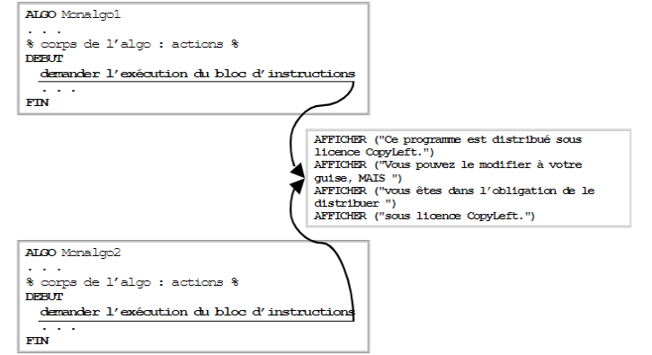

2. Pour rendre la structure générale de l'algorithme plus lisible, extraire chacun des calculs et avoir une seule ligne dans l'algorithme principal pour les appeler

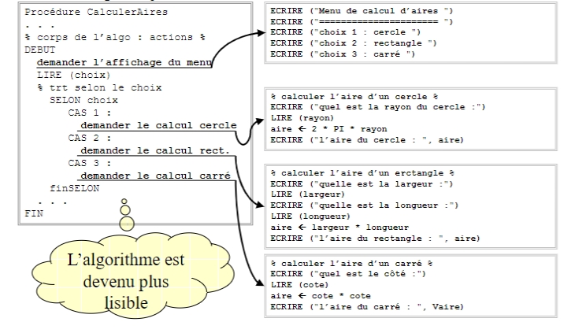

3. Pour réutiliser la formule de calcul de l'aire d'un carré ou d'un rectangle, définir un calcul d'aire qui prend 2 valeurs (coté1 et coté2) (ppour le carré, coté1 et coté2 auront la même valeur) et appeler ce calcul

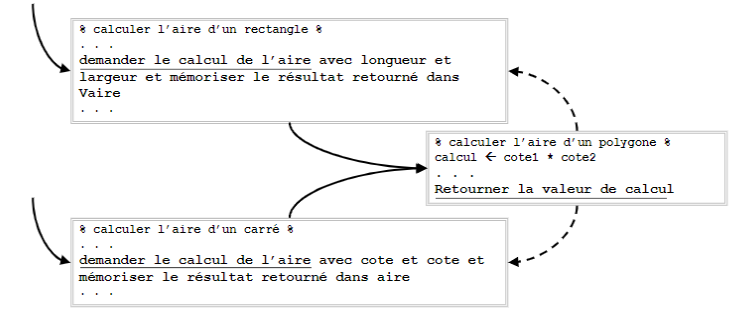

Les blocs de codes qu'on va extraire devront être **identifiés** pour être appelés, et constitueront des sortes d'**algorithmes indépendants** : on distinguera l'algorithme dit **'algorithme principal'** de ces derniers qui seront appelés **'sous-programmes'**.

<ins>**B. Définition**</ins>

> Un **SOUS-PROGRAMME** est un moyen de **NOMMER UNE ACTION COMPLEXE** (composée généralement de plusieurs actions ou calculs élémentaires).
>
> - soit parce qu'on sera amené à l'**UTILISER PLUSIEURS FOIS** dans un ou plusieurs autres algorithmes (on parle de réutilisation)
> - soit de manière à **RENDRE LA STRUCTURE D'UN ALGORITHME PLUS CLAIRE** et **LISIBLE**.

Synonymes : module, procédure, fonction

**Un sous-programme est donc une formule particulière d'algorithme : on ne l'exécutera jamais directement, il sera toujours "APPELE" par un algorithme principal ou par un autre sous-programme.**

Une fois défini, le sous-programme pourra être utilisé tout comme une instruction classique (les parenthèses mises à part).

> On parle de **MODULARITE** pour décrire la **QUALITE D'UN ALGORITHME A ÊTRE DIVISE EN PLUSIEURS SOUS-PROGRAMMES** (ou modules), de manière à le rendre plus lisible et donc plus facilement modifiable (maintenable).

<ins>**C. Deux formes de sous-programmes : Fonctions et Procédures**</ins>

Dans les exemples d'algorithmes présentés ci-dessus, 2 formes essentielles de sous-programmes apparaissent :

* En 1 et 2 : des sous-programmes correspondant un bloc d'actions à exécuter : on les appelle **"PROCEDURES"**
* En 3 : un sous-programme correspondant à un bloc d'actions qui va retourner une valeur résultat (l'aire calculée) : on l'appelle **"FONCTION"**.

<ins>**D. Paramètres et Arguments**</ins>

Les <ins>sous-programmes sont relativement indépendants de l'algorithme principal.</ins> Cependant uls nécessitent souvent des données pour effectuer leur traitement.

Les données utilisées par l'algorithme principal lui sont propres (on dit qu'elles sont **locales** à l'algorithme principal, elles ne sont pas connues hors de celui-ci) : il faut donc un mécanisme pour assurer le passage de données entre l'algorithme principal et les sous-programmes. La notion de PARAMETRES (et arguments), correspond à ce mécanisme.

> Les **PARAMETRES** (*paramètres formels*) d'une procédure (ou fonction) **DEFINISSENT LES DONNEES NECESSAIRE A SON FONCTIONNEMENT**, les valeurs attendues pour son fonctionnement.
>
> Les **ARGUMENTS** (*paramètres réels ou effectifs*) correspondent aux **VALEURS QUI SONT EFFECTIVEMENT PASSEES** à cette procédure (ou fonction) **AU MOMENT DE SON APPEL**.

Les paramètres sont le moyen de communiquer des données entre l'algorithme principal et les sous-programmes.

**<ins>Attention</ins>**: **il arrive très souvent que ces notions de "paramètres" et "arguments" soient indifféremment utilisées pour représenter ces 2 notions.**

<ins>**E. Exécution**</ins>

Lorsque, dans l'exécution d'un algorithme, un sous-programme est appelé, l'algorithme principal s'interrompt, l'exécution du sous-programme a lieu, puis l'exécution l'algorithme principal reprend le contrôle de l'exécution, celle-ci reprenant à la première instruction qui suit l'appel du sous-programme.

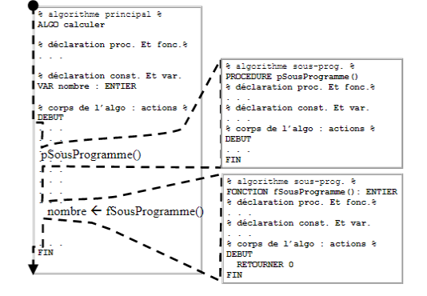

<ins>**II) Fonctions**</ins>
____________________________

> Une **FONCTION** est un **SOUS-PROGRAMME** qui exécute un certain nombre d'actions et qui **RENVOIE** une **VALEUR DE RETOUR** au terme de son exécution.

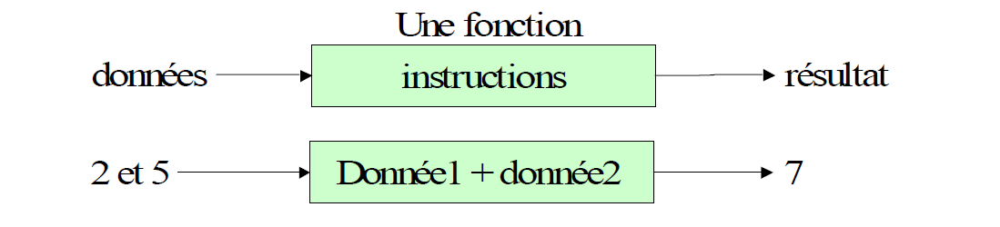

> **Une FONCTION est un SOUS-PROGRAMME de type "EXPRESSION" : son exécution fournit un résultat utilisable comme une expression : affectgation, affichage, autre expression.**

<ins>**A. DEFINIR une fonction : entête et corps de la fonction**</ins>

La définition d'une fonction consiste à :

1. Définir l'**ENTETE** de la fonction :
   
   a. IDENTIFIER LA FONCTION

   b. DECLARER LA LISTE DES PARAMETRES

   c. DEFINIR LE TYPE DE DONNEES RENVOYE
2. Définir le **CORPS** de la fonction
   
   a. DECRIRE L'ALGORITHME : constantes et variables,actions

<ins>**Syntaxe de la DEFINITION d'une fonction: **</ins>

> FONCTION nom_fonction (par1, ..., parN) : type_retour
> .... déclarations des variables de la fonction
> .... actions entre DEBUT et FIN
> finFonction

* **nom_fonction:** identifiant de la fonction (exemple de convention : préfixé par 'f')
  * utiliser un verbe (ou le début d'un verbe) pour nommer une fonction :
* **parl, ..., parN :** déclaration des paramètres attendus par la fonction (passés par valeur)
* **type_retour** : type de données du résultat renvoyé par l'exécution de la fonction
  * type de données de base, structure

<ins>Exemple :</ins>

```
FONCTION fCalculerDuree (VAR pAnDeb : ENTIER, VAR pAnFin : ENTIER) : ENTIER
DECLARATIONS
    VAR duree : ENTIER
DEBUT
    duree <- pAnFin - pAnDeb
    RETOURNER duree
FIN
FinFonction
```

Utilisation de la fonction fCalculerDuree dans un algorithme :

```
    LIRE anNais, anCour
    ECRIRE "Vous avez ", fCalculerDuree(anNais,anCour), " ans"
...
```

> Dans une **FONCTION**, l'**INSTRUCTION <ins>'RETOURNER'</ins> PERMET DE RENVOYER LA DONNEE RESULTAT** à l'algorithme principal ou au sous-programme qui a effectué l'appel.

```
RETOURNER valeur
```

* **valeur** est le nom d'une variable ou constante, d'un litéral ou correspond à une expression.

On peut faire un parallèle avec la notion mathématique de fonction :

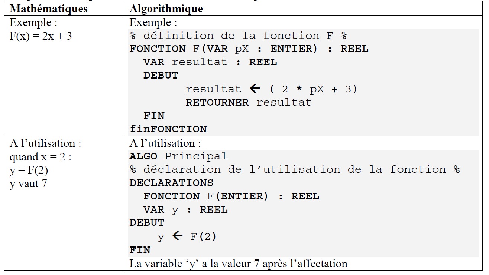

<ins>**B. Fonctions et "effet de bord"**</ins>

L'effet de bord (En anglais *"side effect"*) désigne les effets produits par l'exécution d'un algorithme sur son environnement. On considère qu'une fonction doit être sans effet de bord, c'est-à-dire, telle qu'une fonction mathématique, ne doit utiliser que les paramètres qui lui sont associés (et les variables locales qui y ont été déclarées).

Cela confirme l'utilisation d'une fonction comme toute autre expression.

<ins>**III) Procédures**</ins>
____________________________

> Une **PROCEDURE** est un sous-programme qui exécute un certain nombre d'actions sans fournir de valeur de retour après son exécution.

> Une PROCEDIRE est un SOUS-PROGRAMME DE TYPE "INSTRUCTION" (inutilisable dans une expression).

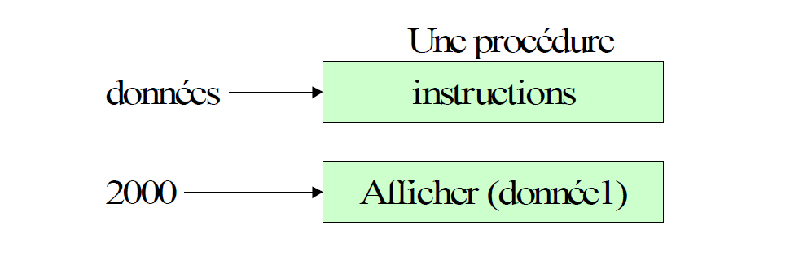

<ins>**A. DEFINIR une procédure : entête et corps de la procédure**</ins>

Définir une procédure consiste à :

1. Définir l'**ENTETE** de la procédure
   
   a. IDENTIFIER LA PROCEDURE

   b. DECLARER LA LISTE DES PARAMETRES
2. Définir le **CORPS** de la procédure :
   
   a. DECRIRE L'ALGORITHME : constantes et variables, actions

<ins>**Syntaxe de la DEFINITION d'une procédure :**</ins>

```
PROCEDURE nom_procedure (par1, ..., parN)
    ... déclaration des variables de la procédure
    ... actions entre DEBUT et FIN
FinProcédure
```

* **pNom_procedure** : nom identifiant la procédure (exemple de convention : préfixé par 'p')
  * utiliser un verbe (ou le début d'un verbe) pour nommer une procédure.
* **par1, ..., parN** : déclaration des paramètres attendus par la procédure
  * mode de passage, suivi de la déclaration d'une variable ou constante.

<ins>Exemple de définition sans paramètres:</ins>

```
PROCEDURE pAfficherMenu ()
DEBUT
    ECRIRE "Menu"
    ECRIRE "===="
    ECRIRE "choix 1 : calculer la surface d'un rectangle"
    ECRIRE "choix 2 : calculer la surface d'un cercle"
    ECRIRE "choix 0 : quitter"
FIN
FinProcedure
```

<ins>Utilisation de la procédure dans un algorithme</ins>

```
...
    pAfficherMenu ()
    LIRE choix
...
```

<ins>Exemple de définition avec des paramètres :</ins>

```
% DEFINITION de la procédure pAfficherSomme %
PROCEDURE pAfficherSomme (VAR pNb1 : ENTIER, VAR pNb2 : ENTIER)
DEBUT
    ECRIRE "la somme est ", (pNb1 + pNb2)
FIN
FinProcedure
```
<ins>Utilisation de la procédure dans un algorithme :</ins>

```
% utilisation dans un algorithme %
...
    LIRE n1, n2
    pAfficherSomme n1, n2
...
```

<ins>**IV) Paramètres et Arguments**</ins>
____________________________

les paramètres sont le moyen de passer des valeurs entre l'algorithme principal et un sous-programme. Il faut **distinguer** la **liste des paramètres déclarés** dans la définition du sous-programme **des arguments passés** lors de son appel.

<ins>**A. Paramètres formels et paramètres réels (ou arguments)**</ins>

**1. paramètres formels**

> Les **PARAMETRES FORMELS** désignent les **PARAMETRES DEFINIS A LA DECLARATION OU LA DEFINITION DU SOUS-PROGRAMME.**

**2. Paramètres réels, ou arguments**

> Les **PARAMETRES REELS, ou paramètres effectifs, ou ARGUMENTS,** désignent les **VALEURS REELLEMENT FOURNIES LORS DE L'APPEL DU SOUS-PROGRAMME.**

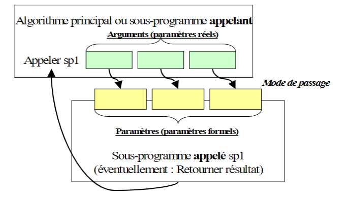

**Les types de données des paramètres réels doivent correspondre aux types de données des paramètres formels.**
**L'ordre des arguments lors de l'appel doit être identique à celui des paramètres déclarés.**

<ins>**B. Modes de passage**</ins>

Les **modes de passage des paramètres définissent comment les valeurs sont passées de l'algorithme principal** (ou d'un sous-programme)** au sous-programme appelé.
*Le mode de passage est précisé la déclaration de chacun des paramètres.

1. Passage par valeur

> Dans le **PASSAGE PAR VALEUR, LA VALEUR DE L'ARGUMENT EST COPIEE DANS LE PARAMETRE FORMEL.**

On a alors 2 variables totalement indépendantes : la variable d'origine qui a servi d'argument et la variable déclarée en tant que paramètre formel.

Le **passage par valeur** est **l'option par défaut** dans la déclaration des paramètres.

<ins>**Déclaration d'un paramètre (formel) :</ins>

```
PAR VALEUR déclaration
```

* Déclaration : toute déclaration valide de variable, constante ou tableau valide

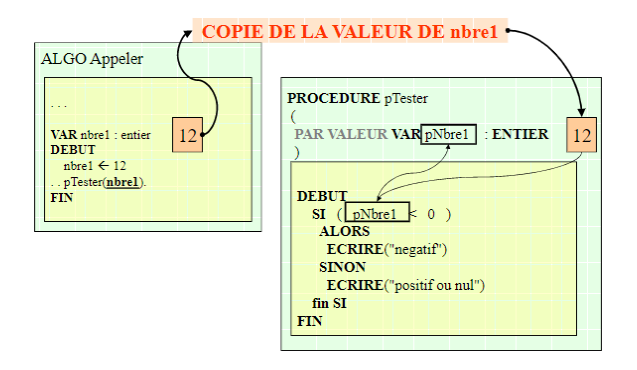

<ins>Exemple (des numéros des pas d'exécution ont été ajoutés) :</ins>

```
ALGO Calculer

% déclaration de la fonction. %
FONCTION fCalculerSurfCarre(VAR pCote: ENTIER) : ENTIER

% déclaration const. Et var. %
VAR cote, calc : ENTIER

% corps de l'algo : actions %
DEBUT
1.      ECRIRE "Entrez le coté :"
2.      LIRE cote    % ex : 8 %
3.      calc <- fCalculerSurfCarre (cote)
6.      ECRIRE calc
FIN

% Définition de la fonction %
FONCTION fCalculerSurfCarre (VAR pCote : ENTIER) : ENTIER
VAR surf : ENTIER
DEBUT
4.      surf <- pCote * pCote
5.      RETOURNER surf
FIN
FinFonction
```

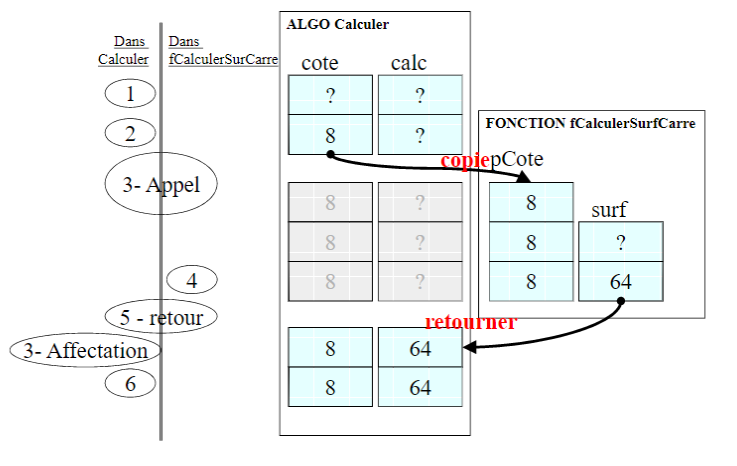

2. Passage par référence

> Dans le **PASSAGE PAR REFERENCE**, le PARAMETRE FORMEL RECOIT UNE REFERENCE VERS LE CONTENU DU PARAMETRE REEL : **<ins>il devient ainsi comme un alias d'un paramètre réel.</ins>**
> <ins>**Toute action effectuée sur le paramètre formel est ainsi reportée directement sur la valeur du paramètre réel.**</ins>
> Dans ce cas, **LES VALEURS D'ORIGINE PEUVENT ÊTRE MODIFIEES PAR LES INSTRUCTIONS DU SOUS-PROGRAMME** (sauf si l'argument est défini comme CONST au lieu de VAR).

<ins>**Déclaration d'un paramètre (formel) :**</ins>

```
PAR REFERENCE déclaration 
```

* Déclaration : toute déclaration de variable, constante

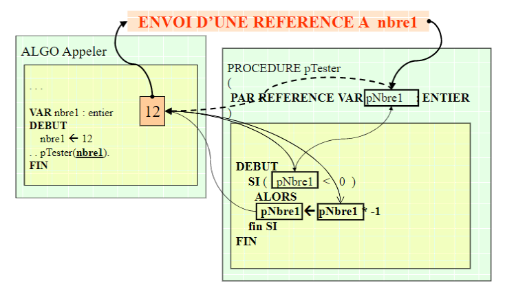

```
ALGO Comparer

% déclaration : prototype. %
PROCEDURE pPermuter (PAR REFERENCE VAR pNb1, PAR REFERENCE pNb2 : ENTIER)

% déclaration const. Et var.algorithme principal %
VAR nb1, nb2 : ENTIER

% corps de l'algo : actions %
DEBUT
1.      ECRIRE "Entrez 2 nombres :"
2.      LIRE nb1, nb2 % ex : 12 et 15 %
3.      pPermuter (nb1, nb2)
7.      ECRIRE nb1, nb2
FIN

% Définition : prototype et implémentation (code). %
PROCEDURE pPermuter (PAR REFERENCE VAR pNb1, PAR REFERENCE pNb2 : ENTIER)
VAR temp : ENTIER
DEBUT
4.      temp <- pNb1
5.      pNb1 <- pNb2
6.      pNb2 <- temp
FIN
FinProcedure
```

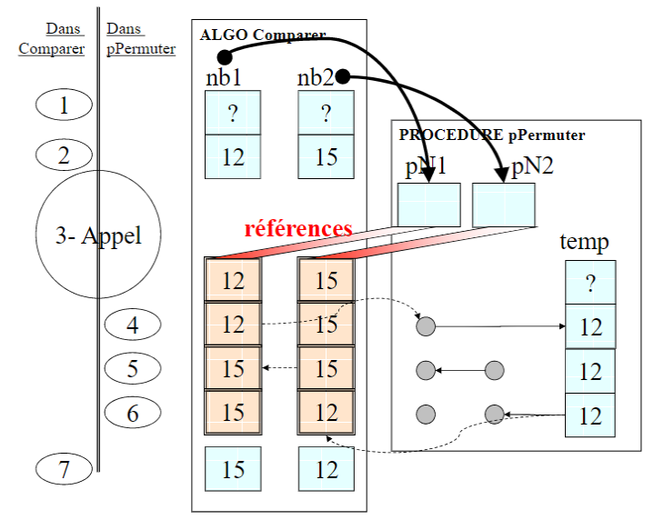

<ins>**V) Déclaration de procédures et fonctions : prototype**</ins>
____________________________

Un sous-programme, procédure ou fonction, doit absolument être connu avant toute utilisation dans un algorithme, en particulier afin de connaître les différents paramètres à lui fournir. De la même manière qu'on doit déclarer une variable avant son utilisation dans un algorithme, on devra :

* soir complètement **définir** la procédure ou la fonction au sein de l'algorithme, avant toute utilisation
* soit simplement **déclarer** le sous-programme avant son utilisation et définir cette procédure après l'algorithme.

Alors que **la définition d'un sous-programme consiste à le décrire complètement** (comment l'appeler et comment l'exécuter), **la déclaration rappelle simplement les éléments nécessaires à son appel** (son prototype).

<ins>**A. DECLARER : notion de prototype**</ins>

> Le **PROTOTYPE** d'une fonction (ou d'une procédure) correspond aux **INFORMATIONS NECESSAIRES A SON APPEL:** son identiant (nom) et sa liste de paramètres (sans son implémentation).

> **DECLARER** une fonction consiste à **DONNER SON PROTOTYPE.**

On parle aussi d'interface avec cette procédure (ou fonction) : cela nous permet de savoir comment l'appeler, sans pour autant connaître son implémentation, le détail du code qu'elle contient, l'algorithme utilisé. On sait seulement quelle rend le service qu'on attend d'elle.

<ins>**Syntaxe de la DECLARATION d'une fonction:**</ins>

```
FONCTION nom_fonc (par1, ..., parN) : type_retour
```

* **fNom_fonc** est le nom donné à la fonction,
* **par1, ..., parN** : déclaration des paramètres attendus <ins>AVEC POSSIBILITE DE DEFINIR UNE VALEUR PAR DEFAUT</ins>
* **type_retour** : type de données retourné par la fonction.


```
FONCTION fCalculerSecondes (VAR : ENTIER, VAR : ENTIER) : ENTIER
```
<ins>**Syntaxe de la DECLARATION d'une procédure:**</ins>

```
PROCEDURE nom_procedure (par1, ..., parN) 
```

* **pNom_procedure:** nom identifiant la procédure
* **par1, ...,parN :** déclaration des paramètres attendus <ins>AVEC POSSIBILITE DE DEFINIR UNE VALEUR PAR DEFAUT</ins>


```
PROCEDURE pPermutter(PAR REFERENCE VAR : ENTIER, PAR REFERENCE VAR : ENTIER)
```

<ins>**VI) Surcharge et signature**</ins>
____________________________

> La **SIGNATURE** d'un sous-programme correspond à l'**IDENTIFIANT DU SOUS-PROGRAMME** associé à la **LISTE DES TYPES DE DONNEES DES PARAMETRES.**

> La **SURCHARGE** d'un sous-programme est un mécanisme offrant la possibilité de **DEFINIR PLUSIEURS SOUS-PROGRAMMES DE MÊME NOM**, mais ayant des **SIGNATURES DIFFERENTES**.

C'est la **différence entre les signatures de chacun des sous-programmes** qui **permet l'appel du bon sous-programme**, par mise en correspondance du type des arguments passés avec le type des apramètres formels.

Les **SOUS-PROGRAMMES** qui portent le même nom mais possèdent des signatures différentes sont dites **SURCHARGES**.

<ins>Exemple :</ins> Une fonction permettant d'effectuer la somme de nombres de types différents

```
ALGO AdditionnerDesNombres

% déclaration : prototype procédure et fonctions %
FONCTION fAdditionner(VAR pV1 : ENTIER, VAR pV2 : ENTIER) : ENTIER

% déclaration des données %
VAR ent1, ent2, resultEnt : ENTIER
VAR reel1, reel2, resultReel : REEL

% corps de l'algo : actions %
DEBUT
    ECRIRE "Entrez 2 nombres entiers:"
    LIRE ent1, ent2
    resultEnt <- fAdditionner(ent1, ent2)
    ECRIRE "Entrez 2 nombres reels:"
    LIRE reel1, reel2
    resultReel <- fAdditionner (reel1, reel2)
FIN

% Définition des sous-programmes %
FONCTION fAdditionner (VAR pV1 : ENTIER, VAR pV2 : ENTIER) : ENTIER
DEBUT
    % additionner  2 entiers %
    RETOURNER (pV1 + pV2)
FinFonction

FONCTION fAdditionner (VAR pV1 : REEL, VAR pV2 : REEL) : REEL
DEBUT
    % additionner 2 réels %
    RETOURNER (pV1 + pV2)
FinFonction
```

<ins>**VII) Déclarations locales et globales**</ins>
____________________________

<ins>**A. Déclarations locales**</ins>

Toute variable ou constante déclarée dans un algorithme ou un sous-programme n'est pas accessible hors de cet algorithme. Elle est uniquement accessible, à l'intérieur de l'algorithme ou du sous-programme, à tous les blocs d'instructions.

<ins>**B. Déclarations globales**</ins>

Il arrive qu'on ait besoin de certaines variables ou constantes dans plusieurs sous-programmes utilisés par un algorithme.
On peut alors qualifier la variable ou la constante de GLOBALE afin de signifier qu'elel devient accessible directement par les sous-programmes, sans nécessité de la passer en paramètres.
<span style="color: #26B260">**CETTE PRATIQUE EST CEPENDANT DECONSEILLEE : ELLE PEUT CONDUIRE A DES EFFETS NON CONTROLES (dits "effets de bord").**</span>

On inclura ces déclarations dans une rubrique DECLARATION GLOBALES précédant la rubrique DECLARATION.

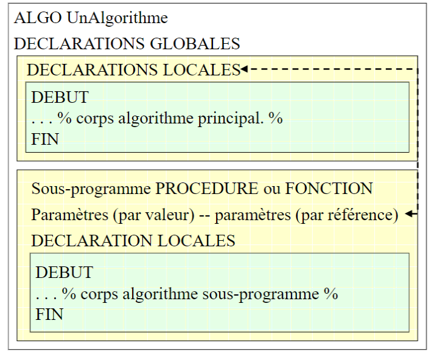

Les déclarations GLOBALES sont disponibles dans l'ensemble de l'algorithme.

Les déclarations LOCALES sont disponibles dans l'algorithme où elles sont définies (et à partir de l'endroit où elles sont définies) et dans tous les blocs imbriqués à l'intérieur de l'algorithme.

<ins>**VIII) Portée et visibilité des déclarations**</ins>
____________________________

<ins>**A. Portée**</ins>

> La notion de **PORTEE** fait référence à la **REGION D'UN ALGORITHME A L'INTERIEUR DE LAQUELLE UNE DONNEE** (variable ou constante) **EST CONNUE**.
> La portée débute après la déclaration, et se termine à la fin du bloc ; elle est active dans tous les blocs imbriqués.

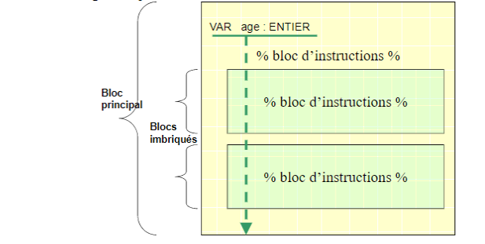

La variable Vage est disponible à partir du moment où elle est déclarée, jusqu'à la fin du bloc où elle est déclarée, et dans tous les blocs d'instructions imbriqués.

<ins>**B. Visibilité**</ins>

> La **VISIBILITE** désigne l'ensemble des blocs d'instruction **où UNE DONNEE EST ACCESSIBLE (non masquée par une déclaration portant le même identifiant)**
> La visibilité est plus petite ou égale à la portée.

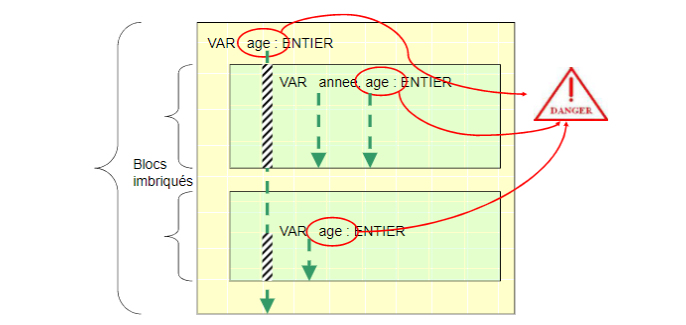

La variable "age" déclarée dans une procédure, voit sa portée masquée par des déclarations dans des blocs imbriqués. (Traits hachurés).

**L'utilisation de variables de même nom dans des blocs imbriqués est à éviter**

<ins>**IX) Intérêt des sous-programmes**</ins>
____________________________

Les sous-programmes permettent de construire des algorithmes structurés et modulaires.

**L'approche descendante** dans la résolution de problèmes favorise la **décomposition** d'un algorithme en sous-programmes. les sous-programmes sont développés de manière incrémentale.

Certains sous-programmes pourront ainsi être à nouveau utilisés dans une **approche ascendante** qui vise à **assembler** (composer) des sous-programmes déjà existants pour construire des algorithmes et répondre au problème posé.

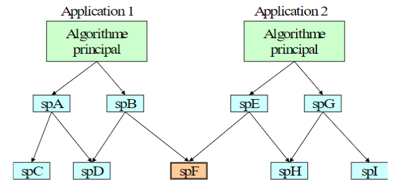

Chaque application, et l'algorithme qui lui correspond, possède des sous-programmes qui lui sont propres. Le sous*-programme 'spF' est utilisé par 2 algorithmes.

<ins>**X) Récursivité**</ins>
____________________________

> La **RECURSIVITE** désigne la démarche utilisant l'appel d'une fonction par elle-même afin de résoudre un problème calculatoire.

La récursivité engendre une pile d’appels récursifs jusqu’à un point terminal d’appel, puis l’utilisation des valeurs retournées par chacun des empilements d’appels.
L’algorithme d’un appel récursif doit donc comporter une structure conditionnelle avec une branche sans appel récursif afin d’interrompre cet empilement.