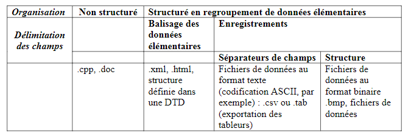
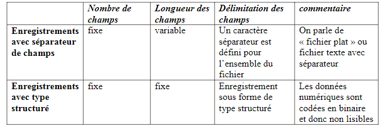
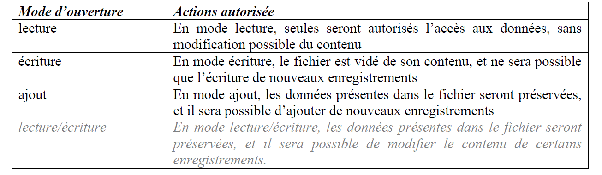
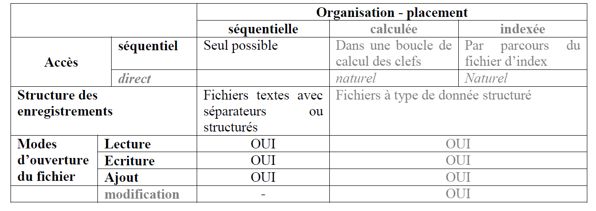

## <ins>**LES FICHIERS**</ins>

<ins>**I) Introduction**</ins>
____________________________

<ins>**A. Notion de fichiers**</ins>

> Un **FICHIER** (En anglais : *file*) est un REGROUPEMENT LOGIQUE DE DONNEES MEMORISEES SUR UN SUPPORT PERMANENT (disque dur, par exemple) afin de permettre une réutilisation ultérieure des informations qu'il contient.

<ins>**B. Structuration des données dans un fichier**</ins>

L'organisation des données dans un fichier correspond à la manière selon laquelle les données seront organisées à l'intérieur du fichier.

**1. Fichiers NON structurés**

On peut énumérer dans cette catégorie tous les fichiers de types documents, codes sources, etc.
Ils sont constitués d’un texte donc la structure n’est pas déterminée : on ne trouve pas de
notion de données élémentaires. Le fichier doit être pris dans son ensemble.
Ces fichiers comportent néanmoins un format reconnu par un programme qui sera capable d’analyser son contenu et d’y trouver un sens. (les .doc sont lus par MS Word).

**2. Fichiers structurés**

Contrairement aux premiers, les fichiers structurés sont composés d’un ensemble de données élémentaires identifiables de manière précise au sein du fichier.

<ins>**a) Structure déterminée par un balisage des données élémentaire.**</ins>

Dans cette catégorie, on trouvera les fichiers de type XML, HTML, etc.. Chaque donnée élémentaire est encadrée par un balisage.

<ins>**b) Structure organisée en enregistrements.**</ins>

Un enregistrement est un bloc de données élémentaires qui décrir une entité. Par exmple, au sein d'un fichier "Clients", un enregistrement correspond aux données relatives à un client.

Un champ est l'une des données élémentaires d'un enregistrement : le numéro de client est l'un des champs d'un enregistrement du fichier client (d'autres seront par exemple, la raison sociale, l'adresse, etc.).

Un enregistrement (En anglais :*record*) est donc composé de plusieurs champs (en anglais : *field ou item*).

Il existe 2 manières d'isoler les champs dans un enregistrement :

* A l'aide d'un caractère séparateur de champs : les données sont codées en ASCII (ou autre format de caractères); un enregistrement correspond à une ligne d'un fichier texte.
* A l'aide d'une définition précise de l'enregistrement et de ses champs grâce à un type structuré.

<ins>**C. Résumé des caractéristiques des fichiers.**</ins>



<ins>**II) Les fichiers de données structurés en enregistrements**</ins>
____________________________

<ins>**A. Détermination des champs de données**</ins>



<ins>**Exemple d’enregistrements d’un fichier texte avec caractère séparateur « ; » :**</ins>

```
1, "Tim";"Burtley";"tb@free.fr"
2,"Max";"Ximum";"max.ximum@yahoo.fr"
```

<ins>**Exemple d'enregistrements d'un fichier avec un type structuré :**</ins>

```
000@Tim     Burtley     tb@free.fr          000çMac     Xinum
        max.xinum@yahoo.fr
```

<ins>**B. Organisation du placement des données**</ins>

L'organisation des données dans un fichier détermine comment seront placés chacun des enregistrements.

<ins>**1. Organisation séquentielle :**</ins>

Dans des fichiers séquentiels, les enregistrements sont mémorisés consécutivement dans l'ordre de leur entrée et peuvent seulement être lus dans cet ordre.

Si on a besoin d'un enregistrement précis dans un fichier séquentiel, il faut lire tous les enregistrements qui le précèdent, en commençant par le premier.

<ins>**2. Organisation calculée :**</ins>

Dans des fichiers à placement calculé, les enregistrements sont placés à une position précise du fichier. Cette position est :

* Soit donnée comme numéro d’ordre de l’enregistrement dans le fichier,
* Soit calculée selon un algorithme de placement appliqué à une clef (on parle de placement aléatoire, en anglais : *random*).

<ins>**3. Organisation indexée :**</ins>

Dans des fichiers à organisation indexée, au moins 2 fichiers sont nécessaires pour chaque fichier géré :

* le premier fichier contient les données
* le second fichier contient une table d’index qui à une valeur d’une clef d’un enregistrement conserve la position du fichier à laquelle il se trouve.

La clef correspond à l’un des champs de l’enregistrement permettant l’identification d’un enregistrement unique au sein du fichier.

<ins>**C. Modes d’accès aux enregistrements d’un fichier**</ins>

L’accès aux enregistrements d’un fichier est déterminé par l’organisation de ce fichier.

<ins>**1. Accès séquentiel :**</ins>

L’accès séquentiel consiste à parcourir, dans l’ordre dans lequel ils sont stockés, les enregistrements d’un fichier. Pour accéder à un enregistrement, il faut avoir lu tous les enregistrements qui le précèdent.

L’accès séquentiel est effectué dans un seul « sens » : on parcourt les enregistrements du début à la fin, sans retour arrière possible.

<ins>**2. Accès direct :**</ins>

L’accès direct permet l’accès individuel à chacun des enregistrements d’un fichier, en y accédant directement :

* Soit grâce à un numéro d’ordre de placement ;
* Soit grâce à une clef.

L’accès direct permet d’accéder à plusieurs enregistrements directement, quelque soit l’emplacement de l’enregistrement dans le fichier.

<ins>**D. Modes d’ouverture d’un fichier**</ins>

Le mode d’ouverture d’un fichier va déterminer les actions que l’on sera autorisé à effectuer sur ce fichier.



<ins>**E. Résumé**</ins>



<ins>**III) Algorithmique fichiers séquentiels**</ins>
____________________________

Le langage algorithmique (*et la plupart des langages de programmation*) met à disposition du programmeur un ensemble d’instructions permettant la manipulation des fichiers.

<ins>**A. Déclaration d’une variable de type FICHIER**</ins>

```
VAR fichier : FICHIER
```
<ins>**B. Ouvrir un fichier séquentiel**</ins>

```
fichier <- OUVRIR(nom_du_fichier , mode_d_ouverture)
```

Avec mode_d_Ouverture parmi : LECTURE, ECRITURE, AJOUT

<ins>**C. Lire un fichier et tester la fin du fichier**</ins>

```
LIRE_FICHIER(fichier, liste_de_variables)

FF(fichier)
```
retourne VRAI si la fin du fichier a été atteinte (il n’y a plus d’enregistrements à lire)

<ins>**D. Ecrire dans un fichier**</ins>

```
ECRIRE_FICHIER(fichier, liste_de_variables)
```
Les données sont ajoutées soit à partir du début du fichier soit à partir de la fin (selon le mode ouverture)


<ins>**E. Fermer un fichier**</ins>

```
FERMER(fichier)
```

<ins>**F. Exemple de programme**</ins>

<ins>Exemple de programme:</ins>

```
...
VARIABLES
f1, f2 de Type FICHIER
num, nom, prenom, email de Type CHAINE

Début
        f1 <- OUVRIR ("fichier1.txt" , LECTURE)
        f2 <- OUVRIR ("fichier2.txt" , ECRITURE)

        % Première lecture %
        LIRE_FICHIER (f1, num, nom, prenom, email)
        Tant Que (NON FF(f1))
                ECRIRE_FICHIER(f2, num, nom, prenom, email)
        % autres lectures  %
                LIRE_FICHIER(f1, num, nom, prenom, email)
        FinTantQue

        FERMER(f2)
        FERMER(f1)
FIN
```

<ins>Exemple de programme 2:</ins>

```
...
TYPE
        STRUCTURE enreg
                num de Type ENTIER
                nom de Type CHAINE
                email de Type CHAINE
        FinStructure

VARIABLE
f3 de Type FICHIER
ligne de Type enreg

DEBUT
        f3 <- OUVRIR('fichier3.dat" , ECRITURE)
        ECRIRE("entrez le numéro, le nom et l'adresse email")
        LIRE(ligne.num, ligne.nom, ligne.email)
        ECRIRE_FICHIER(f3, ligne)
        FERMER(f3)
FIN
```

