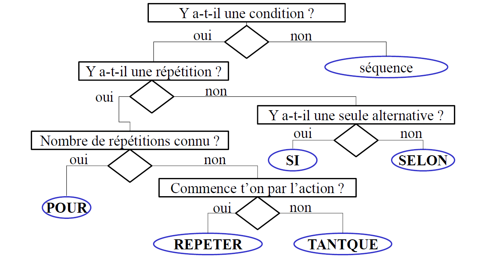

## <ins>**LA DEMARCHE DE CONCEPTION ET DEVELOPPEMENT**</ins>

<ins>**I) Concevoir et développer une app lication informatique**</ins>
____________________________

Le développement d’une application informatique requiert précision et nécessite la mise en oeuvre d’une démarche rigoureuse afin d’éviter tout oubli qui serait préjudiciable à la qualité du produit logiciel. En effet toute étape bâclée ou ignorée est préjudiciable à la suivante et augmente le risque de non-conformité.

Suivre ces étapes consiste à trouver les réponses aux questions posées et mettre en oeuvre les préconisations proposées.

**DEFINIR | ANALYSER | CONCEVOIR | CODER | TESTER | FORMER**

<ins>**A. Définir le problème - QUOI**</ins>

* Quelles données à traiter et comment les obtenir ? (Type, validité, etc.)
* Quels traitements appliquer aux données ? (Calculs, formules, conditions, « règles du jeu », etc.)
* Quels résultats attendus ? (Type, validité, etc.).
* Appuyer par des exemples de données ou de calculs, des schémas, etc.

**-> <ins>Rédaction d'une définition du problème à traiter</ins>** dans laquelle aucune interrogation ne doit subsister. L’interprétation est interdite et elle doit être éclaircie grâce à un dialogue avec le demandeur : langage clair, simple.

Dans le cadre d’un examen, il est nécessaire de proposer le choix d’une option prise si plusieurs possibilités d’interprétation persistent.

<ins>**B. Analyser le problème - COMMENT**</ins>

* Comment recueillir les données nécessaires, quels types leur attribuer, comment les vérifier, les mémoriser ?
* Comment effectuer les traitements nécessaires (différentes possibilités) ?
* Comment présenter les résultats ou les mémoriser ?

**-> <ins>Analyse des différentes manières de traiter le problème</ins>** : proposer, justifier et critiquer les solutions analysées. (Points de vue techniques – données et structures de données, structures de contrôles utilisées, algorithmes standard, etc.-, rapidité, performance, ergonomie, etc.).

<ins>**C. Concevoir la solution algorithme**</ins>

* Concevoir la succession des opérations à réaliser permettant de résoudre le problème : pseudo code, schémas, etc.
* Réutiliser les algorithmes de sous-programmes ayant fait leurs preuves (tri, etc.)
* Vérifier la cohérence et le bon fonctionnement (traces d’exécution des sous-pogrammes et du programme principal)

**-> <ins>Rédaction de l’algorithme de résolution</ins>**

<ins>**D. Coder dans un langage de programmation**</ins>

* Etablir ou utiliser des conventions de nomage pour les identificateurs des données et sous-programmes (cette étape a pu être réalisée précédemment)
* Commenter le programme principal et chaque sous-programme (objectif, auteur, date, modifications faites et à faire, paramètres attendus, valeur retournée, etc.)
* Indenter le code (respecter la position des instructions d’un même bloc)
* Marquer les fins de blocs ou de structures par un commentaire
* Respecter : « Une instruction par ligne »

**-> <ins>Un programme source</ins>** (plusieurs fichiers, éventuellement)

<ins>**E. Tester et mettre au point le programme**</ins>

* Compiler, testez et mettez au point
  * Erreurs de syntaxe : détectées par le compilateur
  * Erreurs de logique : non détectables -> effectuer des traces d’exécution (affichage des variables intéressantes en des points stratégiques du programme
  * Erreurs de données : les données fournies ne sont pas celles attendues (saisie, fichier, etc.)
  * Erreurs de manipulation du code source : inattention, substitution d’une instruction à une autre
* Tester
  * Tester chaque sous-programme séparément
  * Tester le programme complètement (intégration des sous-programmes)
  * Valider l’exécution aux limites des valeurs des données attendues : nombre trop grand, négatif, chaîne vide ou trop longue, etc.

**-> <ins>Un programme exécutable</ins>**

<ins>**F. Former à l’utilisation**</ins>

* Produire une documentation :
  * = comment utiliser le logiciel dans le cas normal (aide « en ligne »)
  * Quelles erreurs sont susceptibles de se présenter (code, message, action à réaliser)
* Former à l’utilisation
* Fournir un formulaire de satisfaction, et un formulaire d’amélioration (caractéristiques supplémentaires, documentation, ordre des saisies, etc.)
* Fournir un formulaire de rapport d’incident demandant les informations nécessaires au diagnostic : programme, contexte de fonctionnement (système d’exploitation et version), contexte provocant l’erreur (données, moment où l’erreur se produit – systématiquement ou non – etc.)

**-> <ins>Documentation, documents de suivi</ins>**

<ins>+Exploitation</ins> : penser à la sécurisation des codes sources et des ²exécutables, et également à la sécurisation et aux sauvegardes des fichiers de données.

<ins>**II) Programmation structurée**</ins>
____________________________

La conception des algorithmes passe essentiellement par une **conception descendante** : cela consiste à diviser le problème en sous problèmes jusqu’à un niveau de raffinement maximal.
A la programmation structurée, sont associés des représentations :

* **Pseudo code**
* Arbre programmatique
* Organigramme (ordinogramme)

Les caractéristiques des algorithmes et programmes étudiés jusqu’à présent étaient les suivantes :

* Un programme avec **un point d’entrée** et **un point de sortie**
* Utilisation des **séquences d’instructions**, des **structures de contrôles** (conditionnelles et répétitives) qui **mettent à jour des données**
* Utilisation de **sous-programmes** de petite taille
* Utilisation d’un style d’écriture clair : commentaires, noms variables, conventions

Les modes de traitements réalisés sont de 2 types :

* Mode de **traitement « batch »** (pat lot) : le programme est lancé, il effectue un traitement et se termine, sans aucune interaction avec l’utilisateur),
* Mode de traitement **faiblement interactif** : dialogue utilisateur – logiciel à travers l’utilisation de couple clavier/écran. Le programme suspend sont exécution et attend la saisie d’une donnée pour poursuivre.

La programmation procédurale est conforme à la programmation structurée, un programme principal appelant des sous-programmes (« procédures ») modifiant des données partagées (ou « passées » en tant qu’arguments) et fournissant un résultat final en un nombre d’étapes déterminé.

<ins>**III) Annexe**</ins>
____________________________

<ins>**A. Choix des structures de contrôle**</ins>

